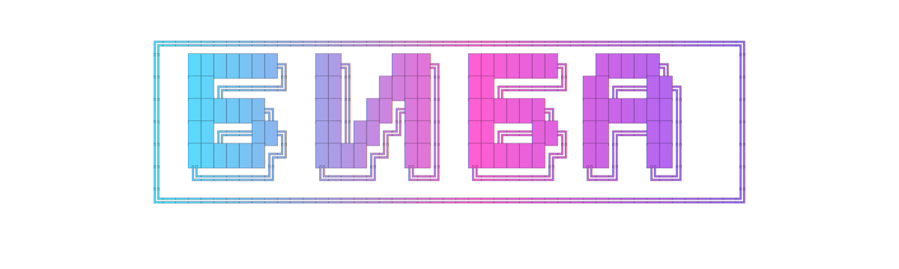

# BiBa

[](https://github.com/GOODWORKRINKZ/biba/actions/workflows/G-Build-All.yml)
[](https://github.com/GOODWORKRINKZ/biba/actions/workflows/G-Build-Controller-Image.yml)

<p align="center">
   
</p>

BiBa — это колесная робот-платформа на базе Raspberry Pi Zero 2W с управлением по ExpressLRS/CRSF, телеметрией от Daly 6S BMS по BLE или USB-UART, двухканальными драйверами BTS7960 и звуковой индикацией через моторы.

## Состав железа

- Raspberry Pi Zero 2W
- ELRS-приемник с подключением по UART/CRSF
- Daly BMS по BLE или с USB-UART адаптером
- 6S аккумулятор с телеметрией BMS
- Два драйвера BTS7960 для левого и правого моторов
- ADS1115 для current sense и телеметрии токов колёс (опционально)

## Распиновка

| Назначение | BCM | Физический пин |
| --- | --- | --- |
| ELRS TX | 14 | 8 |
| ELRS RX | 15 | 10 |
| I2C SDA (ADS1115, опционально) | 2 | 3 |
| I2C SCL (ADS1115, опционально) | 3 | 5 |
| Left BTS7960 RPWM | 12 | 32 |
| Left BTS7960 LPWM | 18 | 12 |
| Left BTS7960 REN | 23 | 16 |
| Left BTS7960 LEN | 24 | 18 |
| Right BTS7960 RPWM | 19 | 35 |
| Right BTS7960 LPWM | 13 | 33 |
| Right BTS7960 REN | 20 | 38 |
| Right BTS7960 LEN | 21 | 40 |
| GND драйвера | - | 14 |

Подробное описание подключения находится в [docs/wiring.md](docs/wiring.md).

Текущий двухмоторный runtime на Pi Zero 2W должен быть запущен с `BTS7960_PWM_MODE=SOFTWARE`, потому что распиновка `12/18` и `19/13` делит общие hardware-PWM каналы. Это уже совпадает и с кодовым default в `config.py`, и с compose-default для развёрнутого робота.

## Структура репозитория

- `biba-controller/` — Python-контроллер для CRSF, моторов, моторного audio/voice runtime и телеметрии BMS
- `lua/SCRIPTS/TELEMETRY/biba.lua` — экран телеметрии EdgeTX для оператора
- `.github/workflows/` — global builder workflows для Ruff, pytest, shellcheck и сборки arm64 Docker-образа в GHCR
- `scripts/setup/` — bringup-скрипты для Raspberry Pi (Docker, Compose, systemd-автозапуск)
- `scripts/biba_aliases.sh` — robot-side operational aliases, включая `bbupdate` для штатного обновления
- `scripts/diagnostics.sh` — диагностика хоста и контейнера
- `scripts/voice_prep.py` — офлайн-подготовка русскоязычных voice assets и явный promote в production voice каталог
- `voice-src/phrases.yml` — канонический набор русских фраз по событиям
- `voice-work/` — staging-каталог для сгенерированных кандидатов перед promote в production voice каталог
- `docs/deployment.md` — полное руководство по развёртыванию
- `.agents/skills/` — вендорный каталог skills

## Подготовка Raspberry Pi

1. Включите UART на Raspberry Pi.
2. Освободите основной UART от Bluetooth, добавив в конфигурацию:

   ```ini
   enable_uart=1
   dtoverlay=disable-bt
   ```

3. Перезагрузите Raspberry Pi.
4. Настройте Daly BMS по BLE или подключите USB-UART адаптер, если используете UART-вариант.
5. Если используете ADS1115 для current sense, включите I2C и проверьте наличие `/dev/i2c-1`.

Вместо ручной установки Docker/Compose можно использовать bringup-скрипт:

```bash
curl -fsSL https://raw.githubusercontent.com/GOODWORKRINKZ/biba/main/scripts/setup/setup_node.sh | bash
```

Скрипт:

- ставит Docker и Docker Compose plugin
- ставит базовые системные утилиты
- клонирует или обновляет репозиторий в `~/biba`
- настраивает алиасы для управления стеком
- создает `systemd` unit для автозапуска `docker compose`

## Запуск

```bash
docker compose pull
docker compose up -d
```

Локальная сборка по-прежнему доступна при необходимости:

```bash
docker compose build
docker compose up -d
```

Контейнер запускает `pigpiod`, слушает ELRS CRSF кадры на `/dev/ttyS0`, управляет моторами, опрашивает Daly BMS по BLE или на `/dev/ttyUSB0` и отправляет батарейную телеметрию обратно на передатчик.

Docker-образ собирается под `linux/arm64`, чтобы совпадать с Raspberry Pi Zero 2W. Для этого `pigpiod` собирается внутри образа из upstream `pigpio`, так как готовый пакет `pigpio` отсутствует в Debian bookworm arm64.

Тип драйвера и распиновку можно переопределить через переменные окружения в `docker-compose.yml`:

- `MOTOR_DRIVER_TYPE=BTS7960|PWM_DIR`
- `BTS7960_PWM_MODE=HARDWARE|SOFTWARE` — для Pi Zero 2W с текущей двухмоторной проводкой нужен `SOFTWARE`
- `LEFT_MOTOR_RPWM=12`
- `LEFT_MOTOR_LPWM=18`
- `LEFT_MOTOR_REN=23`
- `LEFT_MOTOR_LEN=24`
- `RIGHT_MOTOR_RPWM=19`
- `RIGHT_MOTOR_LPWM=13`
- `RIGHT_MOTOR_REN=20`
- `RIGHT_MOTOR_LEN=21`
- `MOTOR1_INVERTED=0|1`
- `MOTOR2_INVERTED=0|1`
- `THROTTLE_FILTER_MODE=NONE|KALMAN` — фильтрация газа до wheel-mix; `NONE` по умолчанию, `KALMAN` сглаживает выбросы канала
- `THROTTLE_KALMAN_PROCESS_NOISE=0.02` — насколько быстро фильтр принимает изменения реального setpoint
- `THROTTLE_KALMAN_MEASUREMENT_NOISE=0.5` — насколько сильно фильтр подавляет шум и ложные выбросы канала
- `CH_SPEED_MODE=5` — `CH6` на передатчике; трёхпозиционный селектор скоростного режима для controller-side scaling газа и руля
- `CH_DRIVE_MODE=6` — `CH7` на передатчике; селектор режимов движения: `manual` и `stabilized`
- `SPEED_MODE_LOW_THRESHOLD=-0.3` — нижний порог селектора в нормализованном диапазоне `-1..1`; ниже этого значения включается режим `1`
- `SPEED_MODE_HIGH_THRESHOLD=0.3` — верхний порог селектора в нормализованном диапазоне `-1..1`; выше этого значения включается режим `3`
- `SPEED_MODE_SLOW_SCALE=0.3333333333333333` — коэффициент для режима `1`
- `SPEED_MODE_MEDIUM_SCALE=0.6666666666666666` — коэффициент для режима `2`
- `SPEED_MODE_FAST_SCALE=1.0` — коэффициент для режима `3`
- `IMU_ENABLED=0|1` — включает autodetect IMU backend на I2C: BMI160/BMI166 или ST LSM6DS3-class
- `IMU_I2C_BUS=1`, `IMU_I2C_ADDRESS=104`, `IMU_EXPECTED_CHIP_ID=209` — параметры подключения IMU; на текущем роботе ST-модуль отвечает по `0x6A`, так что для него нужен `IMU_I2C_ADDRESS=106`
- `IMU_SAMPLE_RATE_HZ=100.0`, `IMU_STALE_TIMEOUT_S=0.2`, `IMU_GYRO_BIAS_CALIBRATION_S=1.0`, `IMU_GYRO_Z_SIGN=1.0` — частота чтения, timeout свежести, длительность bias-калибровки и знак yaw-оси
- `DRIVE_MODE_STEERING_DEADBAND=0.05`, `DRIVE_MODE_STEERING_LIMIT=1.0`, `DRIVE_MODE_YAW_RATE_MAX_DPS=90.0` — базовые ограничения assist-контура
- `DRIVE_MODE_YAW_RATE_KP/KI/KD` — tuning-параметры yaw-rate контура stabilized режима
- `DRIVE_MODE_YAW_RATE_DEADBAND_DPS`, `DRIVE_MODE_YAW_RATE_FILTER_HZ` — подавление мелкого gyro noise и сглаживание yaw-rate feedback
- `DRIVE_MODE_STABILIZATION_MIN_THROTTLE`, `DRIVE_MODE_NEUTRAL_STABILIZATION_STEERING_LIMIT`, `DRIVE_MODE_NEUTRAL_STABILIZATION_MAX_THROTTLE` — low-speed ограничения stabilized режима
- `PID_TUNING_SETTINGS_PATH=/data/pid-tuning.json` — persistent JSON с последними field-tuning значениями stabilized режима
- `BMS_TELEMETRY_TRACE_ENABLED=0|1` — включает точные controller-side trace-логи на этапах consume/send для battery telemetry
- `BEACON_ENABLED=0|1`
- `BEACON_DELAY_S=300`
- `CH_BEACON=7` — `CH8` на передатчике; ручное включение маяка
- `CH_MUTE=9` — `CH10` на передатчике по умолчанию; канал мьюта обычных звуков, если нужен отдельный mute switch
- `CH_TRIM=8` — `CH9` на передатчике; в trim-mode используется как live-источник подстройки межколёсного баланса
- `MOTOR_TRIM_MAX_EFFECT=0.30` — максимальная коррекция, применяемая к одной стороне от полного хода `CH9`
- `MOTOR_TRIM_CONFIRM_HOLD_S=5.0` — сколько секунд держать trim-жест для входа и подтверждения
- `MOTOR_TRIM_SETTINGS_PATH=/data/motor-trim.json` — файл сохранённого trim на persistent Docker volume
- `ENABLE_RC_MELODIES=0|1` — включает выбор BLHeli-мелодий с передатчика
- `CH_MELODY=8` — канал выбора мелодии, если `ENABLE_RC_MELODIES=1`
- `STARTUP_MELODY=biba_signature` — стартовая BLHeli-мелодия при включённом melody-runtime
- `MOTOR_TEST_API_ENABLED=0|1` — включает встроенный HTTP tools UI контроллера
- `MOTOR_TEST_API_HOST=0.0.0.0` — bind host для tools UI
- `MOTOR_TEST_API_PORT=8765` — bind port для tools UI
- `RAMP_ACCEL_RATE=2.0` — скорость разгона мотора (единиц/сек, 0→100% за 0.5с)
- `RAMP_DECEL_RATE=2.0` — скорость отпускания/торможения (единиц/сек, 100%→0 за 0.5с)
- `RAMP_REVERSE_DECEL_RATE=0.5` — скорость подхода к нулю перед сменой направления; меньше значение = мягче переход в реверс
- `RAMP_ZERO_HOLD_S=0.15` — пауза на нуле (секунды) после торможения перед реверсом; даёт мотору физически остановиться и убирает «гавканье» BTS7960
- `MOTOR_DEADBAND=0.05` — мёртвая зона стика (меньше порога → мотор стоит)

Если нужно включить current sense через ADS1115, дополнительно добавьте в `docker-compose.yml` соответствующие env-переменные из `docs/wiring.md`: `MOTOR_CURRENT_SENSE_ENABLED`, `MOTOR_CURRENT_LIMITING_ENABLED`, directional `*_MOTOR_CURRENT_SENSE_*_CHANNEL`, `LEFT_MOTOR_MAX_CURRENT_A`, `RIGHT_MOTOR_MAX_CURRENT_A`, `LEFT_MOTOR_MAX_POWER_W`, `RIGHT_MOTOR_MAX_POWER_W`.

Для калибровочных заездов доступен отдельный trace-режим current sense:

- `MOTOR_CURRENT_TRACE_ENABLED=0|1` — включает JSONL-лог с motor activity, ADS1115 и BMS snapshot
- `MOTOR_CURRENT_TRACE_PATH=/data/current-trace.jsonl` — путь к trace-файлу на persistent volume
- `MOTOR_CURRENT_TRACE_POST_ROLL_S=2.0` — сколько секунд держать запись после окончания motor activity
- `MOTOR_CURRENT_TRACE_MIN_INTERVAL_S=0.0` — минимальный интервал между sample-записями; `0.0` означает без дополнительного rate limit

Этот trace нужен для офлайн-калибровки токов колёс против более медленного тока BMS и по умолчанию выключен.

## Tools UI

Для инженерной проверки и полевого тюнинга на контроллере доступен встроенный HTTP tools UI:

- `http://<robot-ip>:8765/motor-test`
- `http://<robot-ip>:8765/pid-tuning`

### Manual motor test page

Страница `/motor-test` используется для коротких ручных проверок моторных PWM.

- параметры:
   - частота левого канала `100..8000` Гц
   - скважность левого канала `0..100%`
   - частота правого канала `100..8000` Гц
   - скважность правого канала `0..100%`
   - длительность теста в миллисекундах

Страница отправляет `POST /api/motor-test` в тот же controller runtime. Команда выполняется ограниченное время и затем оба канала принудительно выключаются.

Это диагностический путь для коротких ручных тестов драйверов и моторных каналов. Он не заменяет обычное CRSF-управление.

### PID tuning page

Страница `/pid-tuning` нужна для полевой настройки stabilized режима без правки env и без пересборки образа.

- изменения применяются live и сразу сохраняются в `PID_TUNING_SETTINGS_PATH`
- обновления разрешены только пока платформа `disarmed`
- API `GET /api/pid-tuning` возвращает текущие значения, defaults, pending и revision state
- API `POST /api/pid-tuning` принимает новые tuning-параметры
- страница сама опрашивает status API, показывает `pending revision` и блокирует `Apply tuning`, пока платформа `armed`

Доступные параметры:

- `yaw_rate_kp`, `yaw_rate_ki`, `yaw_rate_kd`
- `yaw_rate_deadband_dps`, `yaw_rate_filter_hz`
- `stabilization_min_throttle`
- `neutral_stabilization_steering_limit`
- `neutral_stabilization_max_throttle`

При старте контроллер автоматически загружает последнее сохранённое значение из persistent volume, поэтому удачный field tuning переживает restart и обновление образа. После submit страница может кратко показать queued `pending revision`, а затем перейти в applied state на следующем цикле main loop.

Для текущего кода и текущего робота default уже `SOFTWARE`. Режим `HARDWARE` оставлен только для совместимых конфигураций, где PWM-линии не конфликтуют между собой.

Если после сборки одно из колёс едет в обратную сторону, достаточно выставить для него значение `1`.

Также поддерживается звуковая индикация через моторы:

- автоматический SOS после длительного failsafe
- ручное включение с тумблера передатчика через `CH_BEACON`
- режимы движения на `CH_DRIVE_MODE`: `manual`, `stabilized`
- общий мьют обычных звуков через `CH_MUTE`
- отключение маяка через `BEACON_ENABLED=0`

Отдельный hardware buzzer в текущей конфигурации не нужен: аудио, маяк и voice playback идут через моторный synth.

## Motor Trim

Для полевой подстройки прямолинейности робот поддерживает trim межколёсного баланса:

- при `disarm` держите первые четыре канала в максимуме 5 секунд, чтобы войти в trim-mode
- в trim-mode на Lua-экране появляется badge `t`
- пока trim-mode активен, контроллер берёт trim напрямую из `CH9`
- полный ход `CH9` используется целиком для точности, но на моторы применяется только до `20%` коррекции
- при повторном 5-секундном жесте в `disarm` текущее значение `CH9` сохраняется в `/data/motor-trim.json`
- после выхода из trim-mode используется уже сохранённое значение, а `CH9` снова игнорируется

Файл trim хранится на named Docker volume `biba-controller-data`, поэтому переживает перезапуск контейнера и обновление образа.

## Офлайн voice pipeline

Для голосовых ассетов используется офлайн-пайплайн, а не генерация речи на роботе.

Правила:

- канонические фразы в `voice-src/phrases.yml` должны быть на русском языке
- production runtime по умолчанию использует по одному утверждённому WAV на событие
- новые варианты сначала попадают в `voice-work/`, а не сразу в `biba-controller/voice/`
- при сборке controller image production WAV из `biba-controller/voice/` дополнительно преобразуются в derived spectral cache внутри image, чтобы робот не тратил секунды на FFT-предобработку при arm/disarm/connect voice events

Базовый цикл такой:

1. Обновить русские фразы в `voice-src/phrases.yml`.
2. Сгенерировать approved WAV-кандидаты в `voice-work/`.
3. Явно продвинуть их в production каталог командой `scripts/voice_prep.py promote-approved --manifest voice-src/phrases.yml --base-dir voice-work --repo-root .`.
4. Закоммитить обновлённые WAV в ветку и доставить их на робота через штатный robot-side update workflow `bbupdate`.

Так production voice assets обновляются предсказуемо и без отдельного audition runtime path.

Сами spectral cache artifacts в git не хранятся. Они пересобираются внутри Docker image и в runtime используются автоматически для production voice путей, а для временных или нестандартных WAV контроллер по-прежнему умеет падать обратно на live-анализ.

## CI и образы

GitHub Actions выполняет:

- `ruff check biba-controller/ tests/`
- `pytest`
- сборку arm64 Docker-образа через Buildx на стороне GitHub Actions
- push глобального образа в GHCR

Workflow'ы организованы по схеме `G-*`:

- `G-Build-Controller-Image.yml` — линт, тесты, сборка и push образа контроллера
- `G-Build-All.yml` — верхнеуровневый запуск полной сборки проекта

Базовая модель деплоя теперь такая:

```bash
docker compose pull
docker compose up -d
```

Raspberry Pi не обязан собирать образ локально, он просто забирает готовый arm64-образ из GHCR.

Полное руководство по развёртыванию: [docs/deployment.md](docs/deployment.md)

## Экран телеметрии

Скопируйте `lua/SCRIPTS/TELEMETRY/biba.lua` на SD-карту передатчика в каталог `SCRIPTS/TELEMETRY/`, затем добавьте скрипт как экран телеметрии в EdgeTX/OpenTX.

Текущая версия экрана показывает:

- общее напряжение батареи
- ток в mA
- SOC в процентах
- link quality `RQly`
- 6 ячеек батареи
- `min/max/delta` по ячейкам
- CPU и RAM контроллера
- ток левого и правого моторов
- локальные бейджи `a/b/mode` и speed badge для arm, beacon, drive mode и speed mode
- бейдж `t`, когда на роботе активен trim-mode
- бейдж зарядки, когда батарея находится в состоянии `CHG`
- мигающее предупреждение `LOW`, если минимальная ячейка уходит ниже порога
- wheel animation по throttle/steering с передатчика
- VCP serial logging для захвата telemetry screen данных

Скрипт пытается читать реальные cell sensors (`Cels`), а если передатчик их не отдает, использует fallback-оценку от общего напряжения пакета. Для robot-side status он использует существующие telemetry bits из battery capacity field, а `a/m/b` берёт локально с передатчика.

Для токов колёс semantic contract теперь считается BIBA-специфичным: controller нормализует левый и правый wheel current в канонические значения, а Lua-экран читает уже BIBA-layer helpers. Текущий CRSF carrier mapping через GPS-поля остаётся лишь transport-совместимостью и не должен использоваться как UI-level контракт.

## Каталог skills

В репозитории присутствует вендорный каталог `.agents/skills/`, чтобы локально использовать тот же набор skills, что и в другом рабочем окружении. На первом проходе импорт выполнен без адаптации содержимого.

## Дорожная карта

- Стабилизировать CRSF-контур управления и парсинг BMS на реальном железе
- Добавить unit-тесты для CRSF кадров, парсинга BMS и микширования привода
- Разделить контроллер на ROS 2-ноды после стабилизации одноконтейнерной версии
