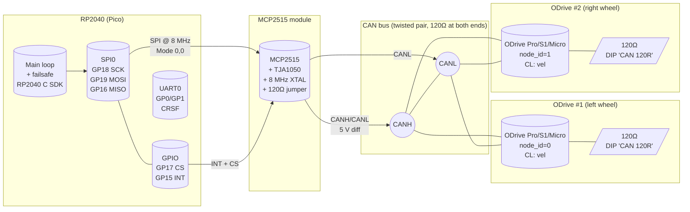

# MCP2515 + BLDC контроллер по SPI/CAN — research

> **Статус:** исследование под новый firmware-таргет `RPICO_RP2040_BLDC` (ветка для работы с BLDC-моторами через MCP2515 → CAN).
> **Назначение:** вводная база для архитектурного ADR и последующей реализации SPI-драйвера MCP2515, очереди CAN-сообщений, парсера BLDC-протокола.
> **Аудитория:** разработчики прошивки, схемотехник (вычитка wiring-части).

## 0. TL;DR

1. **Подключение к Pico** — модуль MCP2515+TJA1050 подключается к SPI0 RP2040: SCK=GP18, MOSI=GP19, MISO=GP16, CS=GP17, INT=GP15. На Pico всё 3.3 В, поэтому питать модуль **только от 5 В через BEC**, а SPI/INT линии соединить **через резистивный делитель 2 кОм/1 кОм** на стороне модуля (по 5 В → 3.3 В), либо взять готовый модуль с on-board level-shifter (см. §3). GP22 в новом target остаётся свободным (в существующем `RPICO_RP2040` он занят IMU_INT1).
2. **SPI mode 0,0** (CPOL=0, CPHA=0), **максимум 10 МГц** по datasheet MCP2515. На RP2040 берём `spi_clk ≈ 7.8 МГц` (делитель 16 от 125 МГц clk_peri) — целое число делителя, ниже 10 МГц cap модуля, совместимо с кварцем 8 МГц.
3. **Топология шины CAN** — два ODrive (left/right wheel) на одной витой паре, 120 Ω терминация на каждом конце. Включаем перемычку терминатора только на **последнем** физическом узле (на одном из ODrive — у ODrive Pro/S1 есть DIP "CAN 120R"; на самом MCP2515-модуле перемычка `RTERM`).
4. **Целевой BLDC-контроллер — ODrive (CANSimple)**. У пользователя уже есть пара ODrive, протокол документирован, есть дисcovery/broadcast (важно для первого включения), watchdog, и цикл `Set_Input_Vel` 8 байт укладывается в одну CAN-frame. См. §5 и §6.
5. **Длина проводов SPI ≤ 100 мм** при 10 МГц на макетной плате; CAN — витая пара, ≤ 5 м на 500 кбит/с (типичная скорость ODrive по умолчанию), ≤ 40 м на 125 кбит/с.

---

## 1. Цель и мотивация

Текущая ветка `rp2040-port` управляет щёточными DC-моторами через BTS7960 (см. `firmware/targets/RPICO_RP2040/target.md` и `docs/wiring.md`). У BTS7960 зафиксирован тепловой режим — дешёвые модули без радиатора перегреваются после ~20-30 мин интенсивной езды (см. `.planning/PROJECT.md` → Context, и Phase 4 UAT).

**Идея:** добавить отдельный firmware-таргет, который вместо BTS7960 управляет парой BLDC-моторов через готовые BLDC-контроллеры, доступные по CAN. На Pico добавляется SPI → CAN мост на MCP2515+TJA1050, а силовая часть выносится в отдельный модуль (ODrive / VESC / …), у которого уже есть proper MOSFET-мост, токовые шунты, термодатчики и EMC-защита.

Преимущества по сравнению с текущим BTS7960:

- промышленный силовой каскад, рассчитан на непрерывную работу;
- встроенные current sense, temperature sense, brake resistor control;
- CAN — дифференциальная шина с приоритезацией сообщений и CRC;
- разделение низковольтной и силовой земли через изолированный трансивер (опционально).

Издержки:

- нужен отдельный модуль MCP2515;
- тайм-критичный код смещается: CRSF-кадр (ELRS) идёт всё ещё на UART0, но команда теперь идёт через SPI→MCP2515→CAN→ODrive, появляется дополнительный latency budget (типично ≤ 5 мс round-trip при 500 кбит/с).

---

## 2. MCP2515 — datasheet essentials

Источник: [MCP2515 Stand-Alone CAN Controller with SPI — DS20001801J (Microchip)](https://ww1.microchip.com/downloads/en/DeviceDoc/MCP2515-Stand-Alone-CAN-Controller-with-SPI-20001801J.pdf), 84 страницы, ревизия 2019 г.

### 2.1 Ключевые характеристики

| Параметр | Значение | Комментарий |
|----------|----------|-------------|
| Поддержка CAN | CAN 2.0B active, до 1 Мбит/с | Совместим с CAN 2.0A (11-bit ID) и 2.0B (29-bit ID) |
| SPI clock (max) | **10 МГц** | При Vdd ≥ 4.5 В; при 3.0–4.5 В — до 5 МГц (см. errata DS80000267) |
| SPI mode | **Mode 0,0** (CPOL=0, CPHA=0) | См. §2.2 |
| Vdd | 2.7–5.5 В | Модуль питаем от 5 В |
| Логические уровни SPI | Vdd-relative | **При Vdd=5 В — логика 5 В** (см. §3) |
| TX буферы | 3 с приоритезацией | — |
| RX буферы | 2 | — |
| Acceptance filters / masks | 6 / 2 (29-bit) | — |
| INT pin | open-drain, active LOW | Pull-up на Vdd модуля |
| Тактирование | external crystal 8 МГц или 16 МГц | На типовых модулях — 8 МГц |

### 2.2 SPI mode

Из datasheet, раздел *Serial Peripheral Interface (SPI)*:

- **CPOL=0** — SCLK idle LOW.
- **CPHA=0** — data sampled on the **rising edge** of SCLK, data changed on the falling edge.
- CS (chip select) — active LOW, должен идти LOW на всю транзакцию.
- Скорость — максимум 10 МГц при Vdd ≥ 4.5 В, 5 МГц при 3.0 ≤ Vdd < 4.5 В (см. errata sheet). Наш модуль питается от 5 В, поэтому 10 МГц доступен.

Для RP2040 это означает:

- `spi_set_slave(SPI_PERIPHERAL, &spi_cfg)` с `cpol = SPI_CPOL_0`, `cpha = SPI_CPHA_0`.
- В pico-sdk это даёт `SPI_CPOL_0 | SPI_CPHA_0` в `spi.cpol/cpha`.
- В arduino-mbed это будет `SPI.setDataMode(SPI_MODE0)` (mbed-style HAL).

### 2.3 SPI frame format

MCP2515 ожидает один управляющий байт (instruction byte), затем 0+ байт данных. Транзакция завершается подъёмом CS.

| Instruction | Формат |
|-------------|--------|
| RESET | `0xC0` |
| READ | `0x03` + addr[7:0] + N data bytes |
| WRITE | `0x02` + addr[7:0] + N data bytes |
| READ RX buffer | `0x90..0x9D` |
| LOAD TX buffer | `0x40..0x4D` |
| RTS (request-to-send) | `0x80..0x82` |
| READ STATUS | `0xA0` |
| BIT-MODIFY | `0x05` + addr + mask + data |

`RX_STATUS` / `BIT-MODIFY` / `RTS` — это single-byte операции, без дополнительной фазы данных.

### 2.4 INT pin

- Active LOW, open-drain, asserted когда в одном из RX-буферов появилось валидное сообщение (прошедшее фильтры), либо по ошибке.
- Host обрабатывает INT в ISR, читает RX buffer, очищает флаг прерывания через `BIT-MODIFY CANINTF`.
- На стороне модуля INT уже подтянут к Vdd через on-board резистор (часто 10 кОм); снаружи дублировать не нужно.

---

## 3. Типовой модуль MCP2515+TJA1050 — pinout, джамперы, питание

Источники: [Last Minute Engineers — MCP2515 tutorial](https://lastminuteengineers.com/mcp2515-can-module-arduino-tutorial/), [ComponentIndex MCP2515 page](https://componentindex.net/components/mcp2515/), [ShillehTek MCP2515 manual](https://shillehtek.com/blogs/shillehtek-product-manuals/mcp2515-can-bus-module-tja1050-receiver-spi-manual), [yasir-shahzad/MCP2515-CAN-Bus-Module schematics](https://github.com/yasir-shahzad/MCP2515-CAN-Bus-Module).

### 3.1 Схема модуля (ASCII)

```
                  ┌──────────────────────────────┐
                  │                              │
   SPI side  ◄───►│  VCC  GND  INT  SCK  SI  SO  CS│   ◄─── input header (6-pin)
                  │                              │
                  │       ┌──────────┐           │
                  │       │ MCP2515  │           │
                  │       │ (CAN ctrl)│          │
                  │       └────┬─────┘           │
                  │            │TXCAN/RXCAN      │
                  │       ┌────┴─────┐           │
                  │       │ TJA1050  │           │
                  │       │(transcv.)│           │
                  │       └────┬─────┘           │
                  │            │CANH/CANL        │
                  │   ┌────────┴────────┐        │
                  │   │ [RTERM JUMPER]  │   ◄─── screw terminal / 2-pin CAN connector
                  │   │ 120 Ω между     │        │
                  │   │   CANH и CANL   │        │
                  │   └─────────────────┘        │
                  └──────────────────────────────┘
```

### 3.2 Входной разъём модуля (со стороны MCU)

| Pin модуля | Функция | Подключение на RP2040 | Примечание |
|------------|---------|----------------------|------------|
| **VCC**    | +5 В питание модуля | BEC (5 В) робота, **не от 3V3 Pico** | TJA1050 требует ≥ 4.75 В для надёжной работы; см. §3.4 |
| **GND**    | земля | GND Pico + GND силовой части | Общая земля обязательна |
| **CS**     | chip select, active LOW | любой свободный GPIO (например GP17) | Один чип на шине — фиксированный GPIO; если несколько MCP2515 — отдельный CS на каждый |
| **SCK**    | SPI clock | SPI0 SCK (GP18) | До 10 МГц, см. §2.1 |
| **SI / MOSI** | host → MCP2515 | SPI0 TX (GP19) | — |
| **SO / MISO** | MCP2515 → host | SPI0 RX (GP16) | — |
| **INT**    | прерывание, open-drain LOW | любой GPIO с прерыванием (GP22 в Pico, GP22 в YD-RP2040; в текущем target уже занят под IMU — взять GP15, см. §3.6) | Внешний pull-up не нужен — он есть на борту |

### 3.3 Выходной разъём модуля (сторона CAN-шины)

- 2-pin винтовой клеммник либо 2-pin header: `CANH`, `CANL`.
- На некоторых модулях есть **дублирующий 2-pin header** для стыковки двух модулей коротким проводом (в этом случае терминация на промежуточных узлах снимается).

### 3.4 Питание: **5 В, не 3.3 В**

Это самый частый footgun с типовым модулем:

- TJA1050 datasheet требует **Vcc 4.75–5.25 В**. При 3.3 В CAN-уровни будут занижены и шина работать не будет.
- Логика SPI на TJA1050-модуле подключена прямо к Vdd (5 В). SCK/MOSI/CS на модуле становятся **5 В CMOS-входами**. RP2040 GPIO 3.3 В — **не 5 В tolerant**, и питать их 5 В нельзя (см. RP2040 datasheet, §1.9.4 "IO Electrical Characteristics", Vih max = 3.6 В).

Решения (по убыванию предпочтения для нашего случая):

1. **Использовать модуль с on-board level-shifter** (например, "MCP2515 CAN Bus Module V2" от ShillehTek — на плате стоит TXS0108E или аналог). Это лучший вариант, питание 3.3 В со стороны MCU.
2. **Резистивный делитель на каждой входной линии модуля**: 2 кОм на GND-стороне + 1 кОм на стороне 5 В. Это делит 5 В до ~3.3 В. Ток на линии мал (модуль потребляет < 1 мкА на входе), падение не мешает. **Нужно ставить делитель только на входы модуля (SCK, MOSI, CS)**; на MISO и INT — там MCP2515 сам тянет в 5 В, и они обратно в 3.3 В GPIO, поэтому **обязательно нужен резистор 1–4.7 кОм последовательно с MISO/INT**, либо external 3.3 В pull-up с диодным смещением.
3. **External level shifter IC** (TXS0108E, SN74LVC8T245, ADG3304) — самое надёжное решение, но добавляет компонент.

> **Рекомендация для PoC**: вариант 1 (купить модуль с shifter). Если модуль уже на руках и без shifter — вариант 2, с явным указанием резисторов на схеме.

### 3.5 Джамперы на типовых модулях

| Джампер / элемент | Назначение | Что делать для BiBa |
|-------------------|------------|--------------------|
| **RTERM (120 Ω)** | Терминатор шины между CANH и CANL | **Снять** на промежуточных узлах; **оставить** на одном физическом конце (на одном ODrive — там есть DIP; либо на самом MCP2515-модуле, если он висит на конце шины) |
| **J1 / J2 (кристалл)** | Не трогать, кварц 8 МГц припаян | — |
| **Резисторы-перемычки для pull-up на INT / TXCAN** | Обычно уже разведены | Не трогать |

> На **большинстве** продаваемых модулей (aliexpress-bulk) единственный пользовательский джампер — это `RTERM`. Некоторые модули (например, ShillehTek) имеют ещё джампер выбора питания 3.3 В vs 5 В.

### 3.6 Конфликт по GP22

GP22 уже занят под `IMU_INT1` в существующем таргете `RPICO_RP2040` (см. `firmware/targets/RPICO_RP2040/target.md` §5). Новый target `RPICO_RP2040_BLDC` стартует с чистого `target.h`, поэтому может свободно выбрать любой GPIO. Рекомендуемая раскладка под RP2040 SPI0:

| Функция    | Pico GPIO | SPI peripheral |
|------------|-----------|----------------|
| SCK        | GP18      | SPI0 SCK |
| MOSI (TX)  | GP19      | SPI0 TX  |
| MISO (RX)  | GP16      | SPI0 RX  |
| CS         | GP17      | GPIO    |
| INT (MCP2515 → RP2040) | GP15 | GPIO с прерыванием |
| Optional: LED status | GP23 | WS2812 — встроенный на YD-RP2040 |

GP15 выбран потому что у него **нет вторичной функции SPI/UART** на стандартной распиновке Pico (в отличие от GP10/14, которые тянут SPI1 — это оставим как резерв для второй SPI-шины, если когда-нибудь добавим второй CAN-модуль).

> При использовании модуля со встроенным level-shifter питание **VCC модуля = 3V3 Pico**, и тогда GP22/GP15 одинаково безопасны.

---

## 4. SPI требования

### 4.1 Электрические

| Параметр | Значение | Источник |
|----------|----------|----------|
| SPI mode | Mode 0,0 (CPOL=0, CPHA=0) | MCP2515 datasheet §SPI |
| Max clock | **10 МГц** (Vdd ≥ 4.5 В) | MCP2515 datasheet DS20001801J §Electrical Characteristics |
| Порядок бит | MSB first | — |
| Setup time (CS LOW до SCK HIGH) | ≥ 50 нс | datasheet AC-traits |
| Hold time (последний SCK HIGH до CS HIGH) | ≥ 50 нс | — |

Для RP2040: при `clk_peri = 125 МГц`, divisor = 16 → `f_spi = 7.8125 МГц`. Это безопасный выбор с запасом и без дробных делителей.

```c
// pico-sdk
spi_init(spi0, 7'812'500);
spi_set_format(spi0, 8, SPI_CPOL_0, SPI_CPHA_0, SPI_MSB_FIRST);
```

### 4.2 Топология и длина проводов

На макетах (MCP2515-модуль, припаянный прямо на breakout-плату рядом с Pico):

- SCK/MOSI/MISO/CS ≤ **100 мм**. На 10 МГц фронт ≈ 35 нс; при длине 100 мм задержка распространения < 6 нс — это безопасно.
- GND должен идти **шиной** под сигнальными проводниками (как минимум параллельно) или быть сплошным polygon-ом — иначе ёмкостная связь через "земляной" провод ловит наводки.

На кабельных сборках (модуль удалён от Pico):

- ≤ 200 мм на 8 МГц при условии, что GND-ток идёт по **отдельной** жиле (или по витой паре SCK+GND, MOSI+GND и т.д.).
- Для стабильного 10 МГц уже нужен ribbon cable либо короткая витая пара; на 5 МГц — обычный dupont-дюпон.

### 4.3 Согласование и ёмкости

- MCP2515 input-pin ёмкость Cin ≈ 10 пФ (по datasheet). На 100 мм дорожке добавится ~10–15 пФ. Допустимый предел без специального termination — около 50 пФ.
- Подтяжки: MISO — внешняя 47–100 кОм pull-up не нужна, CS — отдельный GPIO, можно не подтягивать (RP2040 драйвит его сам).
- Защита: по входам со стороны Pico — TVS-диод 5 В SMAJ5.0A на линиях, приходящих с 5 В модуля, если level-shifter не используется.

---

## 5. Обзор BLDC-контроллеров с CAN

Родительская задача (`t_83ccac50`) явно фиксирует **ODrive** как предпочтительный вариант ("драйвер оldrive древний который, у него интерфейс еще на питоне через orodrive-tool"). Ниже — таблица сравнения и обоснование, почему ODrive остаётся целевым.

| Параметр | ODrive (Pro / S1 / Micro) | VESC 6 (HW 6.x) | MKS SERVO (DroneCAN) | BLHeli_32 / AM32 |
|----------|---------------------------|-----------------|-----------------------|------------------|
| Мотор | BLDC / PMSM, до ~5 кВт | BLDC / PMSM, до ~10 кВт | BLDC closed-loop stepper | BLDC (дрон) |
| Рабочее напряжение | 12–58 В (Pro: до 56 В) | 8–60 В | 12–36 В (по моделям) | до 6S (≈ 25 В) |
| Пиковый ток (тип.) | 60–120 А | 100–300 А | 5–10 А | 30–50 А |
| **CAN physical** | 5-контактный терминал (CANH, CANL, GND, …) | RJ45/4-pin (CANH, CANL, +5V, GND) | 4-pin (CANH, CANL, +5V, GND) | Нет native CAN — DShot |
| **CAN-протокол** | CANSimple (см. §6) | VESC native (см. §7) | DroneCAN (CYphal/UAVCAN v0) | — |
| Frame type | 11-bit ID | 29-bit extended ID | 11-bit ID, DroneCAN-формат | — |
| Битрейт по умолчанию | 250 000 (Pro/S1) или автоотбор (Micro/Pro) | 500 000 (настраивается) | 1 000 000 (DroneCAN) | — |
| Discovery / addressing | **Broadcast + heartbeat + can_enumerate.py** | Настраивается через VESC Tool | DroneCAN node-ID allocation | — |
| Watchdog / failsafe | **Set_Input_* сообщения сбрасывают watchdog** | 0.5 с timeout (настраивается) | DroneCAN health/heartbeat | Bidirectional DShot |
| Документация | Отличная, [docs.odriverobotics.com](https://docs.odriverobotics.com/v/latest/manual/can-protocol.html) | Хорошая, [vedderb/bldc comm_can.md](https://github.com/vedderb/bldc/blob/master/documentation/comm_can.md) | Средняя, [DroneCAN](https://dronecan.github.io) | Ограниченная для CAN |
| Цена (примерно) | ~150 USD / шт | ~70 USD за VESC 6 | ~30–60 USD | ~10–30 USD |
| Ключевая сила | Открытая прошивка, position/torque/velocity | Открытый исходник, e-bike focus | Stepper с обратной связью | Дёшево, дроны |
| Ключевая слабость | Дорого, устаревшая серия (Pro) | Сложный API, требует VESC Tool | DroneCAN требует libcyphal | Нет CAN, нет position control |

### 5.1 Решение по выбору целевого контроллера

**Целевой BLDC-контроллер — ODrive (Pro / S1 / Micro).**

Обоснование:

1. **У пользователя уже есть пара ODrive** — явное требование родительской задачи (`t_83ccac50`). Не покупаем новое железо.
2. **CANSimple протокол документирован** ([CAN Protocol — ODrive Docs](https://docs.odriverobotics.com/v/latest/manual/can-protocol.html)). 11-bit ID, формат `(node_id << 5) | cmd_id`. Это умещается в один регистр MCP2515 и не требует расширенного CAN-формата.
3. **Discovery через broadcast** (cmd 0x06 + RTR, `can_enumerate.py`) упрощает первый запуск: не надо лезть в odrivetool, чтобы выставить node_id.
4. **Watchdog на Set_Input_Vel** — если RP2040 зависнет, ODrive сам заармится в ESTOP через ~100 мс.
5. **Одна команда на команду движения** (`Set_Input_Vel` — 8 байт, float32 vel + float32 torque_ff). В CAN-frame помещается ровно одна команда для одного колеса.
6. **Силовая часть уже сертифицирована** — у Pro есть brake resistor control, overcurrent, overtemperature встроенные.

Trade-offs:

- Цена выше VESC. Принято как факт, что у пользователя уже куплено.
- Старая серия "ODrive (legacy)" может требовать ручной настройки через `odrivetool`. Новый `S1` / `Pro` имеет Web GUI.
- В старой линейке CAN-интерфейс изолирован только частично. Если нужна полная galvanic isolation — поставить изолированный DC-DC между 5 В Pico-стороны и 5 В ODrive-стороны и isolator (ADM3050/ISO1050) в разрыв CANH/CANL. Для **PoC — опционально**.

Резервные варианты на случай, если ODrive окажется недоступен:

- **VESC 6 / VESC 75/300** — стандарт в DIY-ebike. Протокол простой, но требует 29-bit ID. MCP2515 поддерживает, но в коде драйвера надо настраивать extended-frame mask/filter, а не 11-bit.
- **MKS SERVO57D / SERVO42D** — не BLDC в привычном смысле (closed-loop stepper), зато CAN-протокол DroneCAN. Применим для маленьких колёс / робо-руки, не для основного привода BiBa.

---

## 6. ODrive CANSimple — спецификация протокола

Источники:
- [CAN Protocol — ODrive Docs (latest)](https://docs.odriverobotics.com/v/latest/manual/can-protocol.html)
- [CAN Bus Guide — ODrive Docs](https://docs.odriverobotics.com/v/latest/guides/can-guide.html)
- [DBC file at odrive-firmware repository](https://github.com/odriverobotics/ODrive/blob/master/docs/can-protocol.md)

### 6.1 Физический уровень

- **Linear bus topology**, витая пара.
- **CANH ↔ CANH, CANL ↔ CANL** между всеми узлами.
- **120 Ω** терминатор между CANH и CANL на каждом **физическом конце** шины.
- Хороший общий GND между всеми узлами.
- На ODrive Pro / S1 / Micro: 5-pin разъём с CANH, CANL, GND, +5V (через него же питание CAN-трансивера на плате, не все версии), ERR/RST.

### 6.2 Битрейт

- По умолчанию — autobaud. ODrive автоматически определяет битрейт шины при старте. Поддерживает 125 к / 250 к / 500 к / 1000 к.
- Sample point: **87.5%** (8 time quanta: 1 sync + 6 propseg+phase1 + 1 phase2), SJW = 1.
- **Рекомендуемая для первого запуска: 250 кбит/с** — самый надёжный режим, прощает длинные провода и плохое качество земли. Переключить на 500 к если нужна более высокая частота команд.

### 6.3 Framing — CANSimple message ID

```
 11-bit CAN ID
┌───────┬────────┐
│[10:5] │ [4:0]  │
│ node  │ cmd_id │
│ _id   │        │
└───────┴────────┘
  6 бит    5 бит
```

- `node_id`: 0–63. По умолчанию unaddressed `node_id = 0x3F` (ODrive не шлёт cyclic до тех пор, пока не присвоен node_id).
- `cmd_id`: 0–31. Полный список — §6.5.
- `message_id = (node_id << 5) | cmd_id`.

> Пример: отправить `Set_Input_Vel` (cmd_id `0x0D`) на node_id `0` — это CAN-ID `0x0D`. На node_id `1` — `0x2D`.

### 6.4 Endianness и типы

- **Little-endian** для всех multibyte-полей.
- Float — IEEE-754 single (4 байта, little-endian byte order).
- RTR — Remote Transmission Request, для запроса `Get_*` сообщений от ODrive.
- Broadcast: `node_id = 0x3F` — host шлёт, все ODrive принимают.
- Reserved/padding — host ставит 0, ODrive игнорирует.

### 6.5 Команды CANSimple

Полная таблица из официальной документации:

| CMD ID | Name | Direction | Payload |
|-------:|------|-----------|---------|
| `0x00` | Get_Version | ODrive → Host | 8× uint8: Protocol_Version, Hw_Version_Major/Minor/Variant, Fw_Version_Major/Minor/Revision/Unreleased |
| `0x01` | Heartbeat | ODrive → Host | uint32 Active_Errors, uint8 Axis_State, uint8 Procedure_Result, uint8 Trajectory_Done_Flag |
| `0x02` | Estop | Host → ODrive | empty → disarms with `ESTOP_REQUESTED` |
| `0x03` | Get_Error | ODrive → Host | uint32 Active_Errors, uint32 Disarm_Reason |
| `0x04` | RxSdo | Host → ODrive | uint8 Opcode (0=read, 1=write), uint16 Endpoint_ID, uint8 Reserved, uint32 Value |
| `0x05` | TxSdo | ODrive → Host | mirror of RxSdo (response) |
| `0x06` | Address | both | uint8 Node_ID, uint48 Serial_Number — discovery + addressing |
| `0x07` | Set_Axis_State | Host → ODrive | uint32 Axis_Requested_State (0=IDLE, 8=CLOSED_LOOP_CONTROL) |
| `0x09` | Get_Encoder_Estimates | ODrive → Host | float32 Pos_Estimate (rev), float32 Vel_Estimate (rev/s) |
| `0x0C` | Set_Input_Pos | Host → ODrive | float32 Input_Pos, int16 Vel_FF (0.001 rev/s), int16 Torque_FF (0.001 Nm) |
| `0x0D` | Set_Input_Vel | Host → ODrive | **float32 Input_Vel (rev/s), float32 Input_Torque_FF (Nm)** |
| `0x0E` | Set_Input_Torque | Host → ODrive | float32 Input_Torque (Nm) |
| `0x0F` | Set_Limits | Host → ODrive | float32 Velocity_Limit (rev/s), float32 Current_Limit (A) |
| `0x11` | Set_Traj_Vel_Limit | Host → ODrive | float32 Traj_Vel_Limit (rev/s) |
| `0x12` | Set_Traj_Accel_Limits | Host → ODrive | float32 Traj_Accel_Limit, float32 Traj_Decel_Limit (rev/s²) |
| `0x13` | Set_Traj_Inertia | Host → ODrive | float32 Traj_Inertia (Nm/(rev/s²)) |
| `0x14` | Get_Iq | ODrive → Host | float32 Iq_Setpoint, float32 Iq_Measured (A) |
| `0x15` | Get_Temperature | ODrive → Host | float32 FET_Temperature, float32 Motor_Temperature (°C) |
| `0x16` | Reboot | Host → ODrive | uint8 Action (0=reboot, 1=save_config, 2=erase_config, 3=enter_dfu) |
| `0x17` | Get_Bus_Voltage_Current | ODrive → Host | float32 Bus_Voltage (V), float32 Bus_Current (A) |
| `0x18` | Clear_Errors | Host → ODrive | uint8 Identify (1=blink LED для identification) |
| `0x19` | Set_Absolute_Position | Host → ODrive | float32 Position (rev) |
| `0x1A` | Set_Pos_Gain | Host → ODrive | float32 Pos_Gain |
| `0x1B` | Set_Vel_Gains | Host → ODrive | float32 Vel_P_Gain, float32 Vel_I_Gain |
| `0x1C` | Get_Torques | ODrive → Host | float32 Torque_Target, float32 Torque_Estimate (Nm) |
| `0x1D` | Get_Powers | ODrive → Host | float32 Electrical_Power, float32 Mechanical_Power (W) |
| `0x1F` | Enter_DFU_Mode | Host → ODrive | empty |

### 6.6 Минимальный цикл управления

Цикл для режима **velocity control** (наша основная задача):

1. **Discovery (один раз при старте)**:
   - Host → broadcast (CAN-ID = `0x7F` = `0x3F << 5 | 0x06`, RTR=1)
   - ODrive → CAN-ID `0x7F`, payload `{Node_ID, Serial_Number}` (после рандомной задержки ~250 мс).
   - Host отправляет Address command с target `Node_ID` каждому ODrive.

2. **Конфигурация (один раз после addressing)**:
   - `Set_Axis_State(IDLE)`
   - `Set_Limits(velocity_max, current_max)`
   - `Set_Controller_Mode(VELOCITY_CONTROL)` — через RxSdo/TxSdo.

3. **Управление в основном цикле (50–100 Гц)**:
   - `Set_Axis_State(CLOSED_LOOP_CONTROL)` один раз перед стартом движения.
   - Каждый тик: `Set_Input_Vel(target_vel, torque_ff)` — 8 байт payload.
   - Параллельно принимаем `Heartbeat` и `Get_Encoder_Estimates`.

4. **Failsafe**:
   - Если host не шлёт `Set_Input_*` дольше watchdog timeout → ODrive задизармится автоматически. Это **встроенный failsafe уровня 2**: даже если RP2040 зависнет, колесо не закрутится бесконечно.
   - На стороне RP2040 — отдельный failsafe: если CRSF теряется → перестать слать `Set_Input_Vel`, оставить последнюю valid-команду или явный `Estop`.

### 6.7 Расчёт round-trip latency

- Шина 250 кбит/с. `Set_Input_Vel` — 8 байт payload + 47 bit (CAN frame overhead @ 11-bit ID): ≈ 47 × 4 + 64 × 4 = 444 мкс на шине. На 500 кбит/с — 222 мкс.
- MCP2515 SPI round-trip (read status + write TX buffer) ≈ 50 мкс при 8 МГц SPI.
- Итого round-trip host → CAN → ODrive: **~500 мкс** на 250 кбит/с. Это вписывается в CRSF control loop 50 Гц (20 мс).

---

## 7. Альтернативы: VESC (для справки)

Источник: [vedderb/bldc comm_can.md](https://github.com/vedderb/bldc/blob/master/documentation/comm_can.md).

VESC native CAN:

- **29-bit extended ID**: `(controller_id) | ((uint32_t)cmd_id << 8)`.
- Все simple-команды имеют 4-байтовый payload = int32 big-endian с scaling factor.
- Пример: `Set_Current` = cmd `1`, scaling 1000. Чтобы задать 51 А на VESC ID 23: CAN-ID `0x0117`, payload `{0x00, 0x00, 0xC7, 0x38}` = 51000 (big-endian).
- Simple-команды:

  | CMD | Name | Scaling | Unit |
  |-----|------|---------|------|
  | 0 | SET_DUTY | 100000 | % / 100 |
  | 1 | SET_CURRENT | 1000 | A |
  | 2 | SET_CURRENT_BRAKE | 1000 | A |
  | 3 | SET_RPM | 1 | RPM |
  | 4 | SET_POS | 1000000 | deg |
  | 10..13 | relative-варианты | | |

- Status messages: `STATUS(9)`, `STATUS_2(14)`, `STATUS_3(15)`, `STATUS_4(16)`, `STATUS_5(27)`, `STATUS_6(58)`.
- Timeout по умолчанию — 0.5 с; рекомендуется слать команды с фиксированной частотой ≥ 50 Гц.

> Если в будущем добавим VESC-совместимость, потребуется extended-frame в MCP2515. Переключается одним битом в `CANCTRL` и фильтры (маски `0x1FFFFFFF`).

---

## 8. Диаграмма подключения (Mermaid)



ASCII-вариант для печати:

```
                                +-------------+
        +-------+               | ODrive #1   |       +----+
  SPI   | MCP2515|    CANH ---- | left wheel  | ----+ | 120|
 <----> | +TJA1050|----CANL ---- | node_id = 0 |     +-+ Ω  |
  CS,   | (8 MHz)|              +-------------+       +----+
  INT   +-------+                              +
         |       |                  CANH ------+
   RP2040+-------+                  CANL ------+
                                  +
                         +-----------------+
                         | ODrive #2       |
                         | right wheel     |
                         | node_id = 1     |
                         +-----------------+
                              |      |
                              +------+ 120Ω (DIP on last ODrive)
```

---

## 9. Рекомендуемая распиновка таргета `RPICO_RP2040_BLDC`

| Функция | Pico GPIO | SPI/Peripheral | Цель |
|---------|-----------|----------------|------|
| SPI0 SCK | GP18 | SPI0 SCK | MCP2515 SCK |
| SPI0 MOSI (TX) | GP19 | SPI0 TX | MCP2515 SI |
| SPI0 MISO (RX) | GP16 | SPI0 RX | MCP2515 SO |
| MCP2515 CS | GP17 | GPIO | MCP2515 CS |
| MCP2515 INT | GP15 | GPIO (interrupt) | MCP2515 INT |
| CRSF TX | GP0 | UART0 TX | ELRS RX pin |
| CRSF RX | GP1 | UART0 RX | ELRS TX pin |
| Status LED | GP25 | GPIO | встроенный LED Pico |
| NeoPixel | GP23 | PWM / PIO | WS2812 на YD-RP2040 |

> GP10/11/14 остаются свободными — могут быть резервом для второй MCP2515 (если когда-нибудь понадобится отдельная CAN-сеть для BMS/IMU) или для GPIO-выхода общего назначения.

Питание:

- Pico питается от USB (development) или от BEC 5 В через VBUS (на роботе).
- MCP2515-модуль питается от **BEC 5 В робота** (один общий rail с ODrive). Если используется модуль с on-board level-shifter — VCC модуля = 3V3 Pico (предпочтительно, чтобы не городить делители).

---

## 10. Открытые вопросы и точки расширения

1. **Galvanic isolation**: на ODrive Pro есть изолированный CAN, на старой линейке — нет. Решение — поставить iso-coupler (ISO1050 / ADM3050) в разрыв CANH/CANL. **Для PoC — отложено**.
2. **RTR-сообщения**: MCP2515 умеет автоматически отвечать на RTR из буфера, но удобнее хосту самому опрашивать через periodic-encoder-msg, настроив `axis.config.can.encoder_msg_rate_ms`. Это упрощает код на стороне RP2040.
3. **Heartbeat → failsafe gate**: использовать Heartbeat от ODrive как дополнительный safety-канал. Если ODrive ушёл в disarmed state — host тоже должен перейти в failsafe (прекратить слать Set_Input_Vel).
4. **Boot-up time**: ODrive autobaud может занять 200–500 мс. RP2040 на это время должен уметь отдавать нулевые команды или явно ждать `Get_Version` от ODrive, и только потом слать `Set_Axis_State(CLOSED_LOOP)`.
5. **Термомониторинг**: на ODrive есть `Get_Temperature` (FET + Motor). У PICО пока нет IMU/ADC на этом target — можно переиспользовать GP26/GP27 как ADC0/ADC1 для NTC-термистора на радиаторе (если нужно).
6. **Двухмоторный режим**: команды на левый/правый ODrive идут параллельно, ID разные (node_id=0, node_id=1). Шина успевает при частоте 50 Гц: `2 × 8 байт × ~500 мкс = 1 мс/cycle` из 20 мс — огромный запас.

---

## 11. Ссылки на источники

### Datasheet и спецификации
- [MCP2515 Stand-Alone CAN Controller with SPI — DS20001801J (Microchip)](https://ww1.microchip.com/downloads/en/DeviceDoc/MCP2515-Stand-Alone-CAN-Controller-with-SPI-20001801J.pdf)
- [MCP2515 product page (Microchip)](https://www.microchip.com/en-us/product/mcp2515)
- [MCP2515 SPI bus notes (Linux kernel DT bindings)](https://trac.gateworks.com/wiki/SPI) — проверка timing на стороне host
- [RP2040 Datasheet (Raspberry Pi)](https://datasheets.raspberrypi.com/rp2040/rp2040-datasheet.pdf)
- [TJA1050 product page (NXP)](https://www.nxp.com/products/interfaces/can-transceivers/can-transceivers/TJA1050)

### Модули и туториалы
- [Last Minute Engineers — MCP2515 CAN Module Tutorial](https://lastminuteengineers.com/mcp2515-can-module-arduino-tutorial/)
- [ComponentIndex — MCP2515 wiring, code, pinout](https://componentindex.net/components/mcp2515/)
- [ShillehTek — MCP2515 CAN Bus Module Manual](https://shillehtek.com/blogs/shillehtek-product-manuals/mcp2515-can-bus-module-tja1050-receiver-spi-manual)
- [yasir-shahzad/MCP2515-CAN-Bus-Module (GitHub)](https://github.com/yasir-shahzad/MCP2515-CAN-Bus-Module)
- [Emre's Bench — Arduino CAN Bus Module Schematic](https://emresbench.com/tips/can.html)

### BLDC протоколы
- [ODrive — CAN Protocol (latest)](https://docs.odriverobotics.com/v/latest/manual/can-protocol.html)
- [ODrive — CAN Bus Guide](https://docs.odriverobotics.com/v/latest/guides/can-guide.html)
- [ODrive — DBC file (firmware repo)](https://github.com/odriverobotics/ODrive/blob/master/docs/can-protocol.md)
- [VESC — CAN-bus communication (vedderb/bldc)](https://github.com/vedderb/bldc/blob/master/documentation/comm_can.md)
- [VESC 6 CAN formats (PDF)](https://vesc-project.com/sites/default/files/imce/u15301/VESC6_CAN_CommandsTelemetry.pdf)
- [DroneCAN (UAVCAN v0) protocol spec](https://dronecan.github.io)
- [MKS DroneCAN integration guide](https://www.mks-servo.com/MKS-Community/MKS-DroneCAN-Intro)

### Внутренние документы проекта
- `docs/wiring.md` — текущая распиновка BTS7960/Pi
- `docs/system_architecture.md` — канонический разбор всех композиций
- `docs/stm32_architecture.md` — STM32F103 распиновка и SPI companion link
- `docs/variants.md` — матрица hardware-вариантов (нужно обновить после выбора целевого BLDC)
- `firmware/targets/RPICO_RP2040/target.md` — текущая распиновка RP2040-таргета
- `.planning/PROJECT.md` — текущее состояние Phase 1, тепловой режим BTS7960
- `.planning/STATE.md` — Phase 4-6 завершены, Phase 7 — IS-RPM интеграция

---

## 12. Выбор зафиксирован

| Решение | Значение |
|---------|----------|
| Целевой SPI-модуль | **MCP2515 + TJA1050** (8 МГц кварц, 120 Ω терминатор по джамперу) |
| SPI mode | Mode 0,0 (CPOL=0, CPHA=0) |
| SPI clock | **7.8125 МГц** (делитель 16 от `clk_peri = 125 МГц`, ниже 10 МГц cap модуля, целочисленный делитель — без jitter) |
| Уровни | Предпочтительно модуль с **on-board level-shifter** (3.3 V), либо резистивный делитель 2k/1k на 5V-линиях с последовательным 1k на MISO/INT |
| Шина | CAN 2.0B active, **11-bit ID**, autobaud, начальный битрейт **250 кбит/с** |
| Целевой BLDC | **ODrive Pro / S1 / Micro** (CANSimple) |
| Протокол | CANSimple: `message_id = (node_id << 5) | cmd_id`, little-endian, IEEE-754 float |
| Command loop | `Set_Input_Vel(0x0D)` каждые 10–20 мс, watchdog сбрасывается сам |
| Discovery | Broadcast `Address(0x06)` с RTR=1 при инициализации |
| Failsafe | Прекратить `Set_Input_*` при потере CRSF → ODrive задизармится по своему watchdog |

Дальнейшие шаги — в задаче `t_3cca56ce` (Architecture нового таргета) и `t_a3ed6b73` / `t_6c05e712` / `t_add4db37` (зависит от декомпозиции). Настоящий документ служит опорой для ADR и `target.md` нового таргета `RPICO_RP2040_BLDC`.