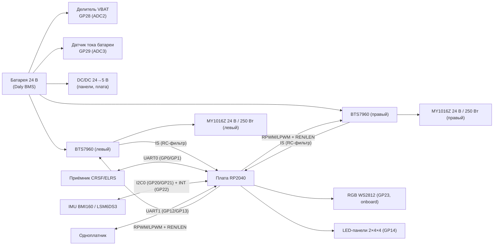

# Вариант 1: коллекторные моторы + BTS7960 (`brushed-bts7960`)

Статус: **ревизия после разбора отказа U2**. Импорт из EasyEDA закрыт,
сверху внесена доработка по [analysis/M1-driver-failure.md](analysis/M1-driver-failure.md) §5:
керамика по питанию драйверов, DC-link, снабберы и супрессоры на выходах,
альтернативный DC/DC. Плата выросла до 180.5 × 100.3 мм.

## Что это

Первый (основной) вариант привода BiBa: два коллекторных редукторных мотора
**MY1016Z**, управляемые двумя модулями **BTS7960**, под управлением платы
**RP2040** (YD-RP2040 / RPi Pico-класс).

## Источник истины

- Таргет: `firmware/targets/RP2040_DC_BTS7960_PWM/` — `target.md` (распиновка), `target.h` (пины).
- Варианты: `docs/variants.md`.
- Шасси: `firmware/tools/cad/sbiba_chassis.py` — MY1016Z 24 В / 250 Вт,
  колесо насаживается прямо на выходной вал редуктора.

## Gerber-анализ (архив 2026-05-27)

Исходник: `Gerber_RP2040_PCB_RP2040_2026-05-27.zip` — экспорт из **EasyEDA**
(`How-to-order-PCB.txt` ссылается на docs.easyeda.com). Двухслойная плата,
нетлиста (IPC-356) в архиве **нет** → схема из гербера напрямую не
восстанавливается (в герберах только разводка и шелкография, без номиналов
и соединений на уровне схемы).

Отрендеренные слои: `gerber/render/` (рендер — `scripts/gerber_render.py`,
через pygerber). Состав платы по меди + шелкографии:

- Слева: посадочное место **RP2040-модуля** (два ряда площадок) + разъём `MPU` (J7).
- Центр: аналоговая обвязка **U1 + RC** (R4–R24, C1–C12) — RC-фильтры и делители.
- Справа: два силовых блока **BTS7960** (M1, M2), толстые токовые дорожки.
- Разъёмы: `UART1` (RX/TX/+5V/SW), `CRSF` (+/−/TX/RX), `BAT`, площадка приёмника `2.4 GHz`.
- Низ: GND-полигон + сигнальная разводка, сквозные переходные.

## Восстановленная схема (из EasyEDA-исходника)

Исходник EasyEDA лежит в `easyeda/RP2040/` (`RP2040.json` — схема,
`PCB_RP2040.json` — плата). Из него восстановлены **57 компонентов и 56 сетей**:

- `easyeda/RP2040/netlist.txt` — полный нетлист (сеть → пины).
- `easyeda/RP2040/components.tsv` — список компонентов (обозначение, номинал, корпус, LCSC).
- Парсер: `scripts/easyeda_netlist.py`.

Архитектура (точнее, чем в `target.md`):

- **Питание:** VIN (24 В) → C9 1000 мкФ → **PM1 SKMW30G-05** (24→5 В) → +5V;
  +5V → **U7 SPX3819M5-L-3-3** (5→3.3 В) → 3.3V.
- **MCU:** IC1 — RP2040 breakout (44 пина), распиновка совпадает с `target.h`.
- **Драйверы моторов:** **4× BTN7970** (U2–U5), по два полумоста на мотор
  (левый: U2 high + U3 low; правый: U4 high + U5 low). Выходы M1+/M1− и M2+/M2−.
- **Буфер:** U1 **SN74AHC244DW** — 8 линий PWM/EN от RP2040 → IN/INH драйверов.
- **IMU:** U6 **BMI160** на I2C0 (GP20/GP21) + INT на GP22, подтяжки R22/R23 10 кОм.
- **Токовый сенс:** IS драйверов → R17–R20 (1 кОм) → R_IS/L_IS → RC (C2/C3 0.1 мкФ)
  → IC1.31/32; R11–R16 (10 кОм) — подтяжки IS к GND.
- **VBAT/IBAT:** R26/R25 (1 кОм) → IC1.34/35; разъём H10 (GND/VBAT/IBAT).
- **Периферия:** J3 CRSF (+5V/GND/TX/RX), J4 UART1 (+5V/GND/TX/RX);
  свободные GP10–GP19 выведены на H1–H8 (1×3: GPIO, +5V, GND).
- **Включение:** J2 (SW/GND/+5V/GND) — управление DC/DC; J1 (+5V/PM1_4/GND).

## Состав (блок-схема)



## Распиновка RP2040 (из `target.h`)

| GP  | Функция | Сигнал | Направление | Примечание |
|-----|---------|--------|-------------|------------|
| GP0 | UART0_TX | CRSF TX | ВЫХ | к RX приёмника |
| GP1 | UART0_RX | CRSF RX | ВХ | от TX приёмника |
| GP2 | PWM1A | L_RPWM | ВЫХ ШИМ | слайс 1, канал A |
| GP3 | PWM1B | L_LPWM | ВЫХ ШИМ | слайс 1, канал B |
| GP4 | GPIO OUT | L_REN | ВЫХ | enable правого полумоста (левый драйвер) |
| GP5 | GPIO OUT | L_LEN | ВЫХ | enable левого полумоста (левый драйвер) |
| GP6 | PWM3A | R_RPWM | ВЫХ ШИМ | слайс 3, канал A |
| GP7 | PWM3B | R_LPWM | ВЫХ ШИМ | слайс 3, канал B |
| GP8 | GPIO OUT | R_REN | ВЫХ | enable правого полумоста (правый драйвер) |
| GP9 | GPIO OUT | R_LEN | ВЫХ | enable левого полумоста (правый драйвер) |
| GP10–GP11 | — | free | — | свободны |
| GP12 | UART1_TX | SBC TX | ВЫХ | RP2040 → одноплатник |
| GP13 | UART1_RX | SBC RX | ВХ | одноплатник → RP2040 |
| GP14 | PIO OUT | LED_PANEL | ВЫХ | цепочка WS2812: GP14 → левая → правая |
| GP15 | — | free | — | свободен |
| GP16–GP19 | — | free | — | свободны (SPI0/I2C1/UART0 по выбору) |
| GP20 | I2C0_SDA | IMU SDA | I/O | |
| GP21 | I2C0_SCL | IMU SCL | ВЫХ | |
| GP22 | GPIO IN | IMU INT1 | ВХ | прерывание IMU |
| GP23 | WS2812 | RGB_LED | ВЫХ | NeoPixel на YD-RP2040 |
| GP25 | GPIO OUT | STATUS_LED | ВЫХ | встроенный LED Pico, активный HIGH |
| GP26 | ADC0 | IS_RIGHT | ВХ | RC-фильтр 1 кΩ‖1 кΩ + 0.1 µF от IS правого BTS7960 |
| GP27 | ADC1 | IS_LEFT | ВХ | RC-фильтр 1 кΩ‖1 кΩ + 0.1 µF от IS левого BTS7960 |
| GP28 | ADC2 | VBAT | ВХ | делитель напряжения, коэфф. `BIBA_VBAT_DIVIDER_RATIO` |
| GP29 | ADC3 | IBAT | ВХ | выход датчика тока батареи |

## Силовые цепи

- Шина **24 В** — батарея (Daly BMS) → оба BTS7960, датчик тока батареи,
  вход DC/DC 24→5 В.
- Шина **5 В** — питание LED-панелей и Vin платы RP2040
  (панели в худшем случае ~0.9 А на 32 светодиода, белый на ходу).
- Шина **3V3** — логика (с платы RP2040), IMU, приёмник CRSF.
- Общая земля силовой и логической частей (как в `docs/wiring.md`).

## Измерения (АЦП)

| Канал | Пин | Сигнал | Калибровка |
|-------|-----|--------|------------|
| ADC0 | GP26 | IS_RIGHT | RC 1 кΩ‖1 кΩ + 0.1 µF от IS-пинов BTS7960 |
| ADC1 | GP27 | IS_LEFT | RC 1 кΩ‖1 кΩ + 0.1 µF от IS-пинов BTS7960 |
| ADC2 | GP28 | VBAT | `BIBA_VBAT_DIVIDER_RATIO = 10.12` (калибровано 2026-05-26) |
| ADC3 | GP29 | IBAT | `BIBA_IBAT_AMPS_PER_VOLT = 1.0`, `BIBA_IBAT_ZERO_OFFSET_V = 0.0` |

Ключевые константы из `firmware/include/biba_config.h`:

- `BIBA_PWM_FREQUENCY_HZ = 20000` (несущая 20 кГц, выше слышимого).
- `BIBA_CONTROL_LOOP_HZ = 500`, `BIBA_TELEMETRY_PUBLISH_HZ = 200`.
- Левый/правый PWM-канал делят один слайс (фиксированный wrap) —
  независимые несущие на канал не поддерживаются
  (`BIBA_TARGET_HAS_PER_CHANNEL_TIMER_PWM = 0`).

## BOM (черновик)

| # | Компонент | Кол-во | Примечание |
|---|-----------|--------|------------|
| 1 | Плата RP2040 (YD-RP2040, USB-C, 2 МБ Flash) | 1 | совместима с RPi Pico |
| 2 | Модуль BTS7960 43A dual H-bridge | 2 | по одному на мотор |
| 3 | Мотор MY1016Z 24 В / 250 Вт, редукторный | 2 | левый/правый, колесо на валу |
| 4 | Приёмник CRSF/ELRS | 1 | UART0 (GP0/GP1) |
| 5 | IMU (BMI160 или LSM6DS3-class) | 1 | I2C0 (GP20/GP21), INT на GP22 |
| 6 | Батарея 24 В + Daly BMS | 1 | силовая шина |
| 7 | Резисторный делитель VBAT | 1 | коэфф. 10.12 → GP28 |
| 8 | Датчик тока батареи (IBAT) | 1 | выход на GP29 |
| 9 | RC-фильтры IS: 1 кΩ‖1 кΩ + 0.1 µF | 2 | IS BTS7960 → GP26/GP27 |
| 10 | RGB WS2812 | 1 | onboard YD-RP2040 (GP23) |
| 11 | LED-панели WS2812 4×4 | 2 | цепочка GP14 → левая → правая |
| 12 | DC/DC 24→5 В | 1 | питание панелей и платы |

## Известные риски

- **Тепловой режим BTS7960** — известное слабое место под длительной
  нагрузкой (старт/стоп/реверс дают 3–10× номинал тока). См.
  `.planning/phases/04-thermal-hardening/` — учитывать радиаторы/обдув
  и токовую защиту при проектировании платы.
- Термо-защита снимается импульсом на `REN`/`LEN` (100 мкс LOW), PWM при
  этом должен оставаться нулём. См. `.planning/phases/03-field-ready/`.
- **Отказы драйвера U3 («M1 задний ход») на плате RP2040** — разбор обвязки
  BTN7970, трассировки и прошивки: [`analysis/M1-driver-failure.md`](analysis/M1-driver-failure.md).

## Открытые вопросы (решить при отрисовке схемы)

1. Тип датчика IBAT (ACS712 / INA226 / шунт+усилитель) — уточнить по факту.
2. Предохранители на линии 24 В моторов (номинал, плавкие/автомат).
3. Разъёмы: батарея (XT60/XT30?), моторы, приёмник, IMU, SBC.
4. Интерфейс BMS (Daly BLE/UART) — выводить ли на плату.
5. Разводка GP29/IBAT: калибровочные коэффициенты по конкретному датчику.

## KiCad-проект (сгенерирован автоматически)

Импорт из EasyEDA закрыт целиком: и схема, и плата.

| Файл | Что это |
|------|---------|
| `brushed-bts7960.kicad_pro` | проект (классы цепей перенесены из `DRCRULE` EasyEDA) |
| `brushed-bts7960.kicad_sch` | схема: 69 компонентов, 58 цепей (импорт 1:1 = 57/56, плюс доработка ниже) |
| `brushed-bts7960.kicad_pcb` | плата 180.51 × 100.33 мм, 2 слоя, 69 компонентов (импорт был 124.51 × 100.33) |
| `sym-lib-table` / `fp-lib-table` | таблицы библиотек |
| `kicad/common/symbols/biba.kicad_sym` | символы |
| `kicad/common/footprints/biba.pretty/` | 14 футпринтов, выгруженных с платы |

Генераторы (импорт **разовый** — оба откажутся затирать существующий файл
без `--force`, потому что схема и плата дальше ведутся в KiCad):

```
python scripts/easyeda_sch2kicad.py kicad/variants/brushed-bts7960   # схема
python scripts/gen_pcb.py           kicad/variants/brushed-bts7960   # плата
```

`gen_pcb.py` требует Python из состава KiCad (модуль `pcbnew`) — находит его
сам, при нестандартной установке задайте `KICAD_HOME`. Плату импортирует
штатный конвертер `kicad-cli pcb import` (формат EasyEDA / JLCEDA Std),
свой парсер платы не пишем.

### Что проверено

- **Связность совпадает с исходником EasyEDA побитово**: 56 сетей,
  220 пин-назначений, расхождений нет.
- **Схема и плата сходились 1:1 на момент импорта**: все 56 цепей совпали
  по составу пинов, одинаковый набор из 57 обозначений, футпринт в схеме
  равен футпринту на плате, все ссылки `biba:*` разрешаются в `biba.pretty`.
  Расходились только имена 12 неподписанных цепей (KiCad зовёт их
  `Net-(U2-IS)`, EasyEDA звал `U2_6`) — на связность это не влияет.
  После доработки ниже схема опережает плату на 11 компонентов.
- **DRC: 0 неразведённых пар**, гербера и сверловка экспортируются.
- ERC: 2 ошибки `power_pin_not_driven` (`+5V` и `GND` не имеют
  power-output пина). Это было и до импорта платы — лечится расстановкой
  `PWR_FLAG` в схеме.

### Оставшиеся замечания DRC (555, все — свойства исходника)

| Кол-во | Проверка | Почему так |
|--------|----------|------------|
| 199 | `pth_inside_courtyard` | массивы переходных падов под силовыми выходами заходят в courtyard U2–U5 — так и задумано |
| 185 + 49 + 28 + 1 | `silk_*`, `text_height` | шелкография EasyEDA: подписи наезжают друг на друга и на медь |
| 64 | `padstack` | у пассивов 0805/0603 в EasyEDA выставлено расширение пасты −100 мм, т.е. «паяльной пасты нет». В оригинальном `Gerber_TopPasteMaskLayer.GTP` апертур под эти пады действительно нет — перенесено как есть |
| 22 | `lib_footprint_mismatch` | одноимённые футпринты в исходнике расходятся на доли микрона и сдвинутыми подписями; эталоном берётся самый массовый экземпляр |
| 7 | `starved_thermal` | термо-развязка в один луч вместо двух (правила KiCad строже, чем у EasyEDA) |

Два полигона (`VIN` F.Cu и `GND` B.Cu) пустые — у них вырожденный контур
в самом исходнике EasyEDA (площадь 0 и 0.5 мм²). Оставлены как есть.

### Чего импорт не переносит

- **Правила DRC** — переносит уже `gen_pcb.py` (зазор 0.152 мм,
  дорожка 0.254 мм, via 0.61/0.305 мм; отдельный класс `5v` — дорожка 0.5 мм).
  Без этого плата осталась бы с дефолтами KiCad (зазор 0.2 мм), под которые
  она не разводилась.
- **Заливку полигонов** — импортёр переносит контуры без вырезов под чужие
  цепи, поэтому `gen_pcb.py` перезаливает их штатным `ZONE_FILLER`
  (иначе DRC показывает ~900 ложных пересечений).
- **3D-модели** — `kicad/common/3dmodels/` пуст.

### Свободные пады и отверстия

EasyEDA держит вне компонентов 425 объектов, KiCad заводит под них
псевдо-футпринты `Pad_ggeNNNN` / `Hole_ggeNNNN`. Все помечены board-only
(мимо BOM и pos-файлов). Состав:

- 400 падов 0.61/0.3 мм на `M1±`/`M2±` — токовые переходные массивы;
- 12 падов 1.0/0.6 мм на `GND` — сшивка земли;
- 6 падов 5×4 мм со сверловкой 2 мм — силовые клеммы `VIN`, `GND`, `M1±`, `M2±`;
- 5 отверстий 3.2 мм NPTH — крепёж;
- 2 пада 2.0/0.91 мм — отводы `+5V` и `GND`.

### Доработка после импорта (2026-09-21)

В схему добавлен блок защиты и развязки по
[`analysis/M1-driver-failure.md`](analysis/M1-driver-failure.md) §5 —
подробности и обоснование номиналов в §5a того же документа:

- **C10–C13** 470 нФ X7R 50 В — керамика VS–GND у каждого драйвера U2–U5 (§5.1);
- **C14** 1000 мкФ 50 В low-ESR — DC-link у пары U2/U3, где его не хватало (§5.2);
- **R27+C15**, **R28+C16** 22 Ом 5 Вт + 100 нФ 100 В плёнка — RC-снабберы
  между выходами каждого моста, M1+/M1− и M2+/M2− (§5.7);
- **D1, D2** 1.5KE30CA — супрессоры на выводах моторов, параллельно снабберам.

Шина VIN при этом осталась без супрессора — §5.3 анализа и статья просят TVS
именно там. Закрывается третьим корпусом (D3) на VIN–GND у клеммы.

Стало: 68 компонентов, 58 цепей (добавились `M1_SNUB`, `M2_SNUB`). ERC без
новых замечаний. Для TVS заведён символ `biba:TVS_BIDIR`; футпринты
выводных деталей взяты из стандартных библиотек KiCad (`Diode_THT`,
`Resistor_THT`, `Capacitor_THT`) — они резолвятся через глобальную
`fp-lib-table`, в проектную ничего добавлять не нужно.

Заодно метка цепи в схеме переименована `Vin` → `VIN`: имена сетей в KiCad
регистрозависимы, а на плате и во всей документации цепь называется `VIN`.

### Ревизия платы (2026-09-21)

Доработка перенесена на плату. **Плата выросла: 124.51 × 100.33 → 180.51 ×
100.33 мм** (+56 мм вправо). Снабберные резисторы 5 Вт — выводные 25×9 мм с
шагом 30.5 мм, на старую плату они не помещались нигде: ближайшее свободное
место было в 48 мм от клемм мотора, что смысл снаббера убивает.

Новая полоса справа от клемм:

Компоненты стоят вертикальными колонками: супрессор у самых клемм
(x≈216), за ним мощный резистор (x≈226), за ним плёнка (x≈236).
Мощные резисторы развёрнуты вертикально — так полоса по горизонтали
освобождается под PM2.

| Группа | Состав | Расположение |
|--------|--------|--------------|
| M1 | D1, R27, C15 | y 50…84 |
| M2 | D2, R28, C16 | y 86…120 |
| Питание | PM2 (альтернативный DC/DC) | x 240…267, y 60…112 |

Шины M+ и M− идут параллельно и нигде не пересекаются: от клеммы к
супрессору поверху, дальше через резистор к плёнке и обратно понизу.

PM2 сдвинут влево и целиком помещается на плате. В первой раскладке он
стоял у правого края, и его корпус (52.4 мм при рядах выводов 20.32 мм)
вылезал за контур на 8 мм — пады были внутри, а тело нет.

**PM2 — альтернативный DC/DC Mean Well NSD10-48S5** (22–72 В → 5 В / 2 А,
DIP-6, футпринт `Converter_DCDC_MeanWell_NSD10_THT` из стандартной
библиотеки KiCad). У него **свои отверстия**, не общие с PM1: назначение
выводов 3/4/5 у модулей разное (у SKMW30G-05 на выводе 3 плюс выхода, у
NSD10 — минус), поэтому общая разводка сожгла бы NSD10. Каждый модуль
разведён по своему даташиту, ставится **один из двух**.

Керамика C10–C13 стоит слева от выводов драйверов (под корпусом TO-263
места нет), пад GND заведён переходным отверстием на нижний GND-полигон.
C14 1000 мкФ — вверху, симметрично C9.

Схема и плата сходятся: 69 компонентов с обеих сторон, все 58 цепей
совпадают по составу пинов.

### Силовая часть: стекап и земля драйверов

Стекап задан явно — **медь 70 мкм (2 oz)** на обоих слоях, FR-4 1.51 мм,
ENIG. Плата и так делается на 2 oz, но в файле была только общая толщина
1.6 мм, и вес меди оставался догадкой: любой расчёт по геометрии висел в
воздухе.

По расчёту (`scripts/pcb_power_check.py`, разбор — §7 анализа) дорожка M±
шириной 4 мм на 2 oz даёт 20.9 А при перегреве +45 °C, то есть ровно
номинал мотора без запаса на пуск. Поэтому:

- силовым выводам U2–U5 (1 GND, 7 VS, таб) и клеммам VIN/GND/M1±/M2±
  задано **сплошное подключение к полигону** вместо тепловых спиц;
- у вывода 1 каждого драйвера добавлены переходные по GND (было 3 на
  драйвер, стало 5–6), с дорожкой 0.6 мм к паду. Всего переходных GND 22.

Ошибок `starved_thermal` стало 7 → 2 (оставшиеся у IC1, не силовые).

У PM2 разведены VIN (вывод 1) и GND (выводы 2 и 3) — короткими трассами
от силовых клемм.

**Что осталось развести вручную** (6 связей, видны как ratsnest в pcbnew):

- **+5V и SW у PM2.** Эти две цепи идут через всю плату к PM1 (+5V на
  PM1.3, SW на PM1.6) — около 110 мм каждая. Автоматический поиск пути по
  нижнему слою их находит (158 и 191 мм с обходами), но получившиеся два
  длинных выреза **разрезают GND-полигон надвое**: в DRC сразу появляются
  два изолированных островка GND и лишние `starved_thermal`. Это ровно тот
  дефект, который разбирается в §3.4 анализа, поэтому такой вариант
  отброшен. Нужно либо вести их по верхнему слою с ручной укладкой, либо
  принять разрез осознанно и провести его по краю платы.
- **VIN у C10, C11, C12** — прямая трасса к выводу 7 драйвера режет веер
  сигнальных выводов 2–6. Нужен обход низом или ручная трасса. У C13 путь
  был свободен, он разведён.
- Один островок GND у вывода 1 U4.

### Повторный импорт

Библиотека футпринтов и схема генерируются детерминированно — повторный
запуск даёт побайтово тот же результат. А вот сам `.kicad_pcb` конвертер
KiCad каждый раз пересобирает заново (новые UUID, другой порядок объектов),
поэтому перезапуск `gen_pcb.py` даёт огромный diff при нулевых изменениях
по сути. Плату после импорта правим в KiCad; `gen_pcb.py` перезапускаем
только если поменялся исходник `easyeda/RP2040/PCB_RP2040.json`.

## Дальнейшие шаги

1. **Дорастить 6 оставшихся связей** в pcbnew: VIN у C10–C12, +5V и SW у PM2,
   островок GND у U4 (см. раздел про ревизию платы выше).
2. Решить по супрессору на шине VIN (§5.3): добавить D3 или оставить как есть.
3. Расставить `PWR_FLAG` в схеме — закрыть 2 ошибки ERC.
4. Остальные пункты §5 анализа, не вошедшие в эту правку: U1 → AHCT244 (5.4),
   R_SR (5.5), R_IS (5.6), pull-down на входах U1 (5.8), тормозной чоппер (5.9).
5. Разобрать шелкографию (234 предупреждения) — перенос подписей.
6. Решить по 0805/0603: оставить их без паяльной пасты или вернуть апертуры.
7. Подтянуть 3D-модели в `kicad/common/3dmodels/`.
8. Экспорт герберов/BOM для производства из KiCad вместо архива EasyEDA.
