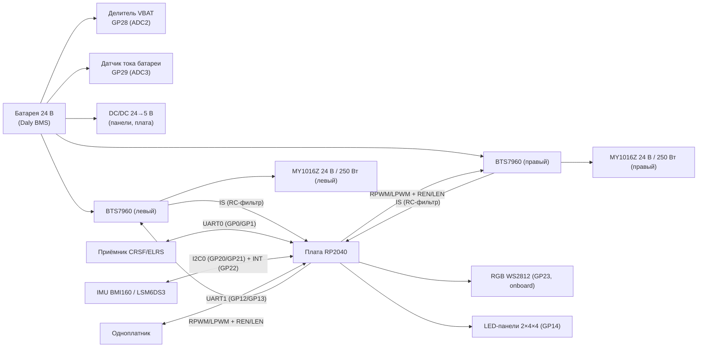

# Вариант 1: коллекторные моторы + BTS7960 (`brushed-bts7960`)

Статус: **план / черновик** — схема ещё не нарисована.

## Что это

Первый (основной) вариант привода BiBa: два коллекторных редукторных мотора
**MY1016Z**, управляемые двумя модулями **BTS7960**, под управлением платы
**RP2040** (YD-RP2040 / RPi Pico-класс).

## Источник истины

- Таргет: `firmware/targets/RPICO_RP2040/` — `target.md` (распиновка), `target.h` (пины).
- Варианты: `docs/variants.md`.
- Шасси: `firmware/tools/cad/sbiba_chassis.py` — MY1016Z 24 В / 250 Вт,
  колесо насаживается прямо на выходной вал редуктора.

## Gerber-анализ (архив 2026-05-27)

Исходник: `Gerber_RP2040_PCB_RP2040_2026-05-27.zip` — экспорт из **EasyEDA**
(`How-to-order-PCB.txt` ссылается на docs.easyeda.com). Двухслойная плата,
нетлиста (IPC-356) в архиве **нет** → схема из гербера напрямую не
восстанавливается (в герберах только разводка и шелкография, без номиналов
и соединений на уровне схемы).

Отрендеренные слои: `gerber/render/` (рендер — `scripts/gerber_render.py`,
через pygerber). Состав платы по меди + шелкографии:

- Слева: посадочное место **RP2040-модуля** (два ряда площадок) + разъём `MPU` (J7).
- Центр: аналоговая обвязка **U1 + RC** (R4–R24, C1–C12) — RC-фильтры и делители.
- Справа: два силовых блока **BTS7960** (M1, M2), толстые токовые дорожки.
- Разъёмы: `UART1` (RX/TX/+5V/SW), `CRSF` (+/−/TX/RX), `BAT`, площадка приёмника `2.4 GHz`.
- Низ: GND-полигон + сигнальная разводка, сквозные переходные.

## Восстановленная схема (из EasyEDA-исходника)

Исходник EasyEDA лежит в `easyeda/RP2040/` (`RP2040.json` — схема,
`PCB_RP2040.json` — плата). Из него восстановлены **57 компонентов и 56 сетей**:

- `easyeda/RP2040/netlist.txt` — полный нетлист (сеть → пины).
- `easyeda/RP2040/components.tsv` — список компонентов (обозначение, номинал, корпус, LCSC).
- Парсер: `scripts/easyeda_netlist.py`.

Архитектура (точнее, чем в `target.md`):

- **Питание:** VIN (24 В) → C9 1000 мкФ → **PM1 SKMW30G-05** (24→5 В) → +5V;
  +5V → **U7 SPX3819M5-L-3-3** (5→3.3 В) → 3.3V.
- **MCU:** IC1 — RP2040 breakout (44 пина), распиновка совпадает с `target.h`.
- **Драйверы моторов:** **4× BTN7970** (U2–U5), по два полумоста на мотор
  (левый: U2 high + U3 low; правый: U4 high + U5 low). Выходы M1+/M1− и M2+/M2−.
- **Буфер:** U1 **SN74AHC244DW** — 8 линий PWM/EN от RP2040 → IN/INH драйверов.
- **IMU:** U6 **BMI160** на I2C0 (GP20/GP21) + INT на GP22, подтяжки R22/R23 10 кОм.
- **Токовый сенс:** IS драйверов → R17–R20 (1 кОм) → R_IS/L_IS → RC (C2/C3 0.1 мкФ)
  → IC1.31/32; R11–R16 (10 кОм) — подтяжки IS к GND.
- **VBAT/IBAT:** R26/R25 (1 кОм) → IC1.34/35; разъём H10 (GND/VBAT/IBAT).
- **Периферия:** J3 CRSF (+5V/GND/TX/RX), J4 UART1 (+5V/GND/TX/RX);
  свободные GP10–GP19 выведены на H1–H8 (1×3: GPIO, +5V, GND).
- **Включение:** J2 (SW/GND/+5V/GND) — управление DC/DC; J1 (+5V/PM1_4/GND).

## Состав (блок-схема)

## Распиновка RP2040 (из `target.h`)

| GP  | Функция | Сигнал | Направление | Примечание |
|-----|---------|--------|-------------|------------|
| GP0 | UART0_TX | CRSF TX | ВЫХ | к RX приёмника |
| GP1 | UART0_RX | CRSF RX | ВХ | от TX приёмника |
| GP2 | PWM1A | L_RPWM | ВЫХ ШИМ | слайс 1, канал A |
| GP3 | PWM1B | L_LPWM | ВЫХ ШИМ | слайс 1, канал B |
| GP4 | GPIO OUT | L_REN | ВЫХ | enable правого полумоста (левый драйвер) |
| GP5 | GPIO OUT | L_LEN | ВЫХ | enable левого полумоста (левый драйвер) |
| GP6 | PWM3A | R_RPWM | ВЫХ ШИМ | слайс 3, канал A |
| GP7 | PWM3B | R_LPWM | ВЫХ ШИМ | слайс 3, канал B |
| GP8 | GPIO OUT | R_REN | ВЫХ | enable правого полумоста (правый драйвер) |
| GP9 | GPIO OUT | R_LEN | ВЫХ | enable левого полумоста (правый драйвер) |
| GP10–GP11 | — | free | — | свободны |
| GP12 | UART1_TX | SBC TX | ВЫХ | RP2040 → одноплатник |
| GP13 | UART1_RX | SBC RX | ВХ | одноплатник → RP2040 |
| GP14 | PIO OUT | LED_PANEL | ВЫХ | цепочка WS2812: GP14 → левая → правая |
| GP15 | — | free | — | свободен |
| GP16–GP19 | — | free | — | свободны (SPI0/I2C1/UART0 по выбору) |
| GP20 | I2C0_SDA | IMU SDA | I/O | |
| GP21 | I2C0_SCL | IMU SCL | ВЫХ | |
| GP22 | GPIO IN | IMU INT1 | ВХ | прерывание IMU |
| GP23 | WS2812 | RGB_LED | ВЫХ | NeoPixel на YD-RP2040 |
| GP25 | GPIO OUT | STATUS_LED | ВЫХ | встроенный LED Pico, активный HIGH |
| GP26 | ADC0 | IS_RIGHT | ВХ | RC-фильтр 1 кΩ‖1 кΩ + 0.1 µF от IS правого BTS7960 |
| GP27 | ADC1 | IS_LEFT | ВХ | RC-фильтр 1 кΩ‖1 кΩ + 0.1 µF от IS левого BTS7960 |
| GP28 | ADC2 | VBAT | ВХ | делитель напряжения, коэфф. `BIBA_VBAT_DIVIDER_RATIO` |
| GP29 | ADC3 | IBAT | ВХ | выход датчика тока батареи |

## Силовые цепи

- Шина **24 В** — батарея (Daly BMS) → оба BTS7960, датчик тока батареи,
  вход DC/DC 24→5 В.
- Шина **5 В** — питание LED-панелей и Vin платы RP2040
  (панели в худшем случае ~0.9 А на 32 светодиода, белый на ходу).
- Шина **3V3** — логика (с платы RP2040), IMU, приёмник CRSF.
- Общая земля силовой и логической частей (как в `docs/wiring.md`).

## Измерения (АЦП)

| Канал | Пин | Сигнал | Калибровка |
|-------|-----|--------|------------|
| ADC0 | GP26 | IS_RIGHT | RC 1 кΩ‖1 кΩ + 0.1 µF от IS-пинов BTS7960 |
| ADC1 | GP27 | IS_LEFT | RC 1 кΩ‖1 кΩ + 0.1 µF от IS-пинов BTS7960 |
| ADC2 | GP28 | VBAT | `BIBA_VBAT_DIVIDER_RATIO = 10.12` (калибровано 2026-05-26) |
| ADC3 | GP29 | IBAT | `BIBA_IBAT_AMPS_PER_VOLT = 1.0`, `BIBA_IBAT_ZERO_OFFSET_V = 0.0` |

Ключевые константы из `firmware/include/biba_config.h`:

- `BIBA_PWM_FREQUENCY_HZ = 20000` (несущая 20 кГц, выше слышимого).
- `BIBA_CONTROL_LOOP_HZ = 500`, `BIBA_TELEMETRY_PUBLISH_HZ = 200`.
- Левый/правый PWM-канал делят один слайс (фиксированный wrap) —
  независимые несущие на канал не поддерживаются
  (`BIBA_TARGET_HAS_PER_CHANNEL_TIMER_PWM = 0`).

## BOM (черновик)

| # | Компонент | Кол-во | Примечание |
|---|-----------|--------|------------|
| 1 | Плата RP2040 (YD-RP2040, USB-C, 2 МБ Flash) | 1 | совместима с RPi Pico |
| 2 | Модуль BTS7960 43A dual H-bridge | 2 | по одному на мотор |
| 3 | Мотор MY1016Z 24 В / 250 Вт, редукторный | 2 | левый/правый, колесо на валу |
| 4 | Приёмник CRSF/ELRS | 1 | UART0 (GP0/GP1) |
| 5 | IMU (BMI160 или LSM6DS3-class) | 1 | I2C0 (GP20/GP21), INT на GP22 |
| 6 | Батарея 24 В + Daly BMS | 1 | силовая шина |
| 7 | Резисторный делитель VBAT | 1 | коэфф. 10.12 → GP28 |
| 8 | Датчик тока батареи (IBAT) | 1 | выход на GP29 |
| 9 | RC-фильтры IS: 1 кΩ‖1 кΩ + 0.1 µF | 2 | IS BTS7960 → GP26/GP27 |
| 10 | RGB WS2812 | 1 | onboard YD-RP2040 (GP23) |
| 11 | LED-панели WS2812 4×4 | 2 | цепочка GP14 → левая → правая |
| 12 | DC/DC 24→5 В | 1 | питание панелей и платы |

## Известные риски

- **Тепловой режим BTS7960** — известное слабое место под длительной
  нагрузкой (старт/стоп/реверс дают 3–10× номинал тока). См.
  `.planning/phases/04-thermal-hardening/` — учитывать радиаторы/обдув
  и токовую защиту при проектировании платы.
- Термо-защита снимается импульсом на `REN`/`LEN` (100 мкс LOW), PWM при
  этом должен оставаться нулём. См. `.planning/phases/03-field-ready/`.
- **Отказы драйвера U3 («M1 задний ход») на плате RP2040** — разбор обвязки
  BTN7970, трассировки и прошивки: [`analysis/M1-driver-failure.md`](analysis/M1-driver-failure.md).

## Открытые вопросы (решить при отрисовке схемы)

1. Тип датчика IBAT (ACS712 / INA226 / шунт+усилитель) — уточнить по факту.
2. Предохранители на линии 24 В моторов (номинал, плавкие/автомат).
3. Разъёмы: батарея (XT60/XT30?), моторы, приёмник, IMU, SBC.
4. Интерфейс BMS (Daly BLE/UART) — выводить ли на плату.
5. Разводка GP29/IBAT: калибровочные коэффициенты по конкретному датчику.

## KiCad-проект (сгенерирован автоматически)

- `brushed-bts7960.kicad_pro` / `.kicad_sch` — проект и схема (57 компонентов, 56 сетей).
- `sym-lib-table` / `fp-lib-table` — таблицы библиотек.
- Символы: `kicad/common/symbols/biba.kicad_sym` (свои символы для всех компонентов).
- Генератор: `scripts/gen_schematic.py` (из `easyeda/RP2040/netlist.json`).
  Повторный запуск: `python scripts/gen_schematic.py kicad/variants/brushed-bts7960`.
- **ERC: 0 ошибок, 0 предупреждений** (`kicad-cli sch erc`).
- Схема в стиле глобальных меток (без длинных проводов) — связи читаются по именам сетей.

## Дальнейшие шаги

1. Назначить футпринты (LCSC-артикулы уже вытянуты в `easyeda/RP2040/components.tsv`).
2. Сгенерировать плату и расставить компоненты (можно восстановить из герберов `gerber/`).
3. DRC → экспорт герберов/BOM для производства.
