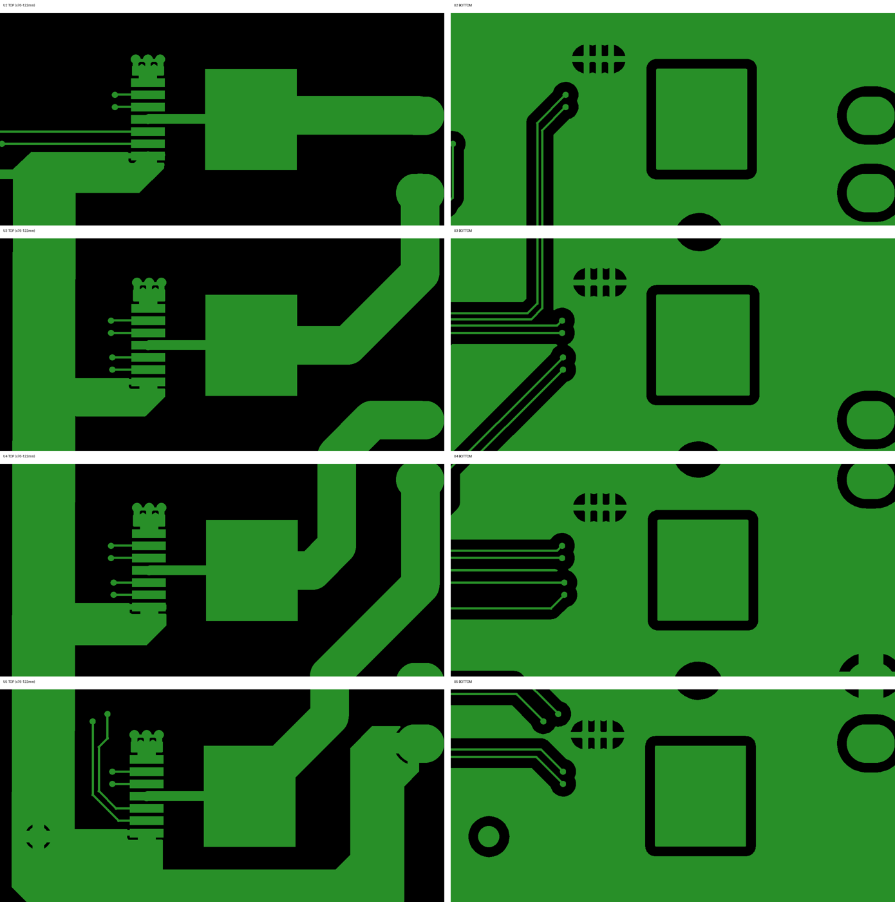

# Анализ отказа: «ключ M1 задний ход» (плата RP2040, 4× BTN7970)

Дата: 2026-09-17. Ревизия платы: EasyEDA `PCB_RP2040.json` / гербер от 2026-05-27
(`../gerber/`), схема `../easyeda/RP2040/RP2040.json`, прошивка `firmware/` (таргет `RPICO_RP2040`).

Симптом: при эксплуатации регулярно выходит из строя драйвер «заднего хода» мотора M1.

> Статус: **гипотезы по результатам разбора документации, платы и прошивки**, уточнённые
> прозвонкой (ниже). Осциллограмм VS и температуры корпуса пока нет — см. раздел «Что измерить».

## 0. Результат прозвонки (2026-09-17)

**Пробит нижний ключ U2**: вывод 1 (GND) ↔ таб/OUT (M1+) — короткое замыкание в обе стороны.
Остальные драйверы — без аномалий.

Почему это согласуется с симптомом «не работает задний ход M1»:

- Из-за `BIBA_RIGHT_MOTOR_DIR = -1` при движении робота **вперёд** ток идёт
  верхний ключ U3 → мотор → **нижний ключ U2 → GND**. Нижний ключ U2 открыт всё это время
  и проводит 100 % тока M1 (и в паузах ШИМ через нижний ключ U3 тоже). При скважности 0
  (торможение накоротко) и поворотах на месте через него идёт ток торможения и пусковой ток.
- При движении **назад** ШИМит верхний ключ U2, но нижний пробит — внутри U2 короткое замыкание
  VS–GND, срабатывает защита, мотор не крутится.

Почему именно нижний ключ U2 (уточнённый порядок причин):

1. **Постоянная нагрузка и нагрев.** Сопротивление нижнего ключа 9 мОм (25 °C) … 17.7 мОм
   (150 °C) → при 20 А это 3.6–7 Вт непрерывно, при пуске и развороте кратковременно 50–80 А.
   TO-263 без радиатора на двухслойной плате.
2. **Земля (п. 3.4).** Весь ток идёт через вывод 1 → 3 перехода Ø0.6 мм со спицами →
   нижний полигон. U2 стоит дальше всех от клеммы GND (y 12.7 мм против 73.7 мм), путь
   возврата самый длинный, переходы греются и подогревают вывод 1.
3. **Далеко от C9 и от входа питания (п. 3.1)**, торможение накоротко и рекуперация (п. 3.2).
   У левого мотора ту же роль играет нижний ключ U5, но он стоит рядом с C9 и клеммой GND.

Действия до повторного включения:

- **Не подавать питание, пока U2 не заменён** (при движении назад U2 замыкает батарею через себя).
- Проверить соседние цепи: U2 выв. 2/3 ↔ U1 выв. 18/16 ↔ GP6/GP8; R12, R11 (≈10 кОм);
  цепь R_IS (R17/R18 → GP26); VIN–GND = OL; осмотреть вывод 1 и GND-переходы U2 (перегрев).
- При замене: надёжнее подключить GND U2 и U4 (перемычка от вывода 1 к полигону/клемме),
  поставить радиатор на табы, добавить керамику и электролит у U2/U3 (п. 5).
- Прошивка: около нуля отпускать мотор накатом вместо торможения накоротко, мягче рампы,
  ограничить ток при повороте на месте. Опционально: в паузах ШИМ свободный ход через верхние
  ключи или чередование, чтобы распределить нагрев с нижнего ключа U2.

### Как проверялось

Батарея отключена, C9 разряжен, моторы отсоединены. Мультиметр в режиме прозвонки диодов,
на каждой микросхеме (ножки влево, таб справа, вывод 1 сверху):

| Щупы (+ / −) | Исправен | Пробит |
|---|---|---|
| таб / выв. 7 | 0.3–0.6 В | ~0 — верхний ключ |
| выв. 7 / таб | OL (растёт) | ~0 — верхний ключ |
| выв. 1 / таб | 0.3–0.6 В | ~0 — нижний ключ |
| таб / выв. 1 | OL | ~0 — нижний ключ |
| выв. 7 / выв. 1 | OL (растёт) | ~0 — у всех 4 сразу (общие цепи) |

## 1. Какой именно ключ

| Сигнал RP2040 | GPIO | Буфер U1 | Драйвер | Выход |
|---|---|---|---|---|
| `R_RPWM` | GP6 | 1A1→1Y1 | **U2** IN | M1+ |
| `R_REN`  | GP8 | 1A2→1Y2 | U2 INH | |
| `R_LPWM` | GP7 | 1A3→1Y3 | **U3** IN | M1− |
| `R_LEN`  | GP9 | 1A4→1Y4 | U3 INH | |

- M1 — **правый** мотор (`R_*`). По названию входа «задний ход» (`R_LPWM`) — это **U3**, но
  прозвонка показала пробой **нижнего ключа U2** (см. раздел 0): именно он проводит ток при движении
  вперёд, а при его пробое перестаёт работать движение назад.
- Распиновка прошивки (`targets/RPICO_RP2040/target.h`) совпадает с платой.
- `BIBA_RIGHT_MOTOR_DIR = -1` (`include/biba_config.h`) ⇒ при движении робота **вперёд**
  ШИМ идёт на `R_LPWM`, т.е. **U3 — самый нагруженный переключающийся ключ на плате**;
  U2 при этом статично держит нижний ключ открытым.
- Схема управления (`biba_hal_motor_rp2040.c`): 20 кГц, ШИМ на одну сторону моста,
  вторая сторона — IN=0 (открыт нижний ключ). Скважность 0 ⇒ оба нижних ключа открыты
  (динамическое торможение накоротко).

## 2. Геометрия силовой части (из гербера и PCB JSON)

| Объект | Координаты, мм | Комментарий |
|---|---|---|
| U2 / U3 / U4 / U5 | x≈97, y = 12.7 / 37.3 / 62.1 / 86.7 | TO-263-7, таб = OUT |
| Клемма VIN (pad 5) | 119.5, 81.3 | внизу справа |
| Клемма GND (pad 6) | 119.5, 73.7 | на BOTTOM подключена 4 «спицами» ≈2–2.5 мм |
| C9 1000 мкФ (единственный) | 76.2, 90.9 | рядом с U5 |
| Шина VIN | TOP-полигон вдоль x≈77–95 | ответвления к пину 7 каждого драйвера |

- Путь по шине VIN от C9/клеммы до пина VS: U5 ≈15 мм, U4 ≈35 мм, **U3 ≈50–60 мм**, U2 ≈80 мм.
- GND каждого драйвера: пин 1 → маленький TOP-островок → **3 перехода Ø0.6 мм** → BOTTOM-полигон
  через **тепловые спицы ≈0.6 мм** (сверловка `Drill_PTH_Through.DRL`, T03 — 12 отверстий, по 3 на драйвер).
- Под табами 400 переходов Ø0.3 мм (T01) на островки OUT на BOTTOM — это сделано нормально.
- BOTTOM-полигон GND в силовой зоне разрезан сигнальными трассами IN/INH/SR/IS.
- Выходные дорожки M± — 4.0 мм (TOP, длина 18–41 мм).

## 3. Найденные проблемы (по убыванию вероятности вклада в отказ)

### 3.1. Нет керамики по питанию драйверов, DC-link далеко — **главный подозреваемый**

- Даташит BTN7970 (§6.2 Layout): керамика **≈470 нФ VS–GND у каждого прибора**.
  Шилд Infineon на BTN8982: 100 нФ VS–GND + 220 нФ OUT–VS/OUT–GND у каждого
  прибора, DC-link 1000 мкФ «с очень короткой разводкой рядом с NovalithIC»,
  требование: **пульсации VS–GND на приборе < 1 В п-п**.
- У нас: керамики нет ни у одного драйвера, единственный C9 стоит у U5.
- U3 — самый нагруженный ключ и одновременно самый далёкий от ёмкости и входа
  (U2 ещё дальше, но при движении вперёд он не коммутирует). Это объясняет, почему
  отказывает именно он, а не U4 (левый «вперёд», в 2 раза ближе к C9).

### 3.2. Порог перенапряжения 28–30 В при батарее 6S (25.2 В)

- BTN7970 `VOV(OFF)` = 28…30 В: драйвер выключает нижний и **открывает верхний ключ,
  игнорируя IN**. Даташит: защитные функции не рассчитаны на повторяющуюся работу.
- Абсолютный максимум VS = 45 В. TVS на входе нет.
- Источники подъёма VS: выбросы от индуктивности шины/проводов (п.3.1), рекуперация при
  сбросе газа (рампа `BIBA_RAMP_DECEL_RATE = 2.0`/с), торможение накоротко при нулевой
  скважности, токоограничение (ICL 50–98 А: при срабатывании открывается противоположный
  ключ — энергия идёт в VS). Если BMS (Daly 6S) закроет заряд — энергии некуда деться.

### 3.3. Потери переключения: R_SR = 10 кОм при ШИМ 20 кГц

- Даташит (VS=13.5 В, 2 Ом): tr/tf(HS) = 0.5–2 мкс при R_SR=0; 1/2/5 мкс (мин/тип/макс)
  при 5.1 кОм; 1.6–11 мкс при 51 кОм. При 10 кОм — порядка 2–4 мкс.
- Грубая оценка: P_sw ≈ 0.5·V·I·(tr+tf)·f = 0.5·25 В·15 А·(4…8 мкс)·20 кГц ≈ **15–30 Вт**
  против ~1–2 Вт потерь проводимости. Даже при кратной ошибке оценки для TO-263 на
  2-слойке без радиатора это перегрев.
- Перегрев ⇒ отключение с защёлкой (сброс — импульс INH low; в прошивке есть
  `biba_bts7960_thermal_reset`). Даташит: частые срабатывания сокращают ресурс.
- Референсы: шилд Infineon — R_SR = **510 Ом** + конденсатор стабилизации SR;
  racecar_1_5 — **510 Ом ‖ 0.1 мкФ**.

### 3.4. Земля драйверов

- Весь ток нижнего ключа идёт через 3 перехода Ø0.6 мм и спицы 0.6 мм.
- Даташит: у BTN7970 нет раздельной силовой/логической земли, смещение между GND
  резисторов SR/IS и пином 1, а также между GND разных драйверов в мосту должно быть
  минимальным. Разрезанный нижний полигон и общий путь возврата к клемме GND это нарушают.
- Шилд Infineon: сплошной GND-слой «максимального размера», минимум 2 перехода на каждый
  конденсатор.

### 3.5. Буфер U1 SN74AHC244 питается от 5 В, вход 3.3 В

- Порог высокого уровня AHC при Vcc=5 В ≈ 0.7·Vcc = 3.5 В > 3.3 В — вход вне спецификации.
  Вместе с «прыгающей» землёй (п.3.4) возможны ложные переключения IN/INH и сквозной ток буфера.
- Входам BTN7970 хватает V_IH ≤ 2.15 В (абс. макс 5.3 В).
- Референс racecar_1_5: тот же SN74AHC244DW, но **от +3.3 В**.
- Исправление: SN74AHCT244DW (тот же корпус SOIC-20) или питать U1 от 3.3 В.
- Нет последовательных резисторов на IN/INH: в даташите и шилде Infineon — 10 кОм
  («защита при замыкании выводов МК на VS»), в racecar_1_5 — тоже 10 кОм.

### 3.6. Цепь IS

- kILIS ≈ 19.5k (11…29k), IIS(lim) = 4…6.5 мА при аварии.
- R_IS = 10 кОм (R9/R11/R13/R15): АЦП (3.3 В) насыщается уже при I ≈ 6 А; при аварии
  напряжение IS стремится к VS, через 1 кОм (R17–R20) в пин RP2040 втекает до ~20 мА.
  BTN7970 это не убивает, но прошивка не видит перегрузку, а RP2040 под угрозой.
- Референсы: шилд Infineon — 1 кОм + 1 нФ, racecar_1_5 — 1 кОм + 1 нФ.
- Комментарии в `target.h` («1kΩ‖1kΩ») не соответствуют плате.

### 3.7. Прошивка

- `biba_hal_motor_audio_begin()`: сначала LPWM=0, затем инверсия канала B ⇒ до первой ноты
  на оба мотора подаётся полный «назад» (рывок на каждой мелодии, включая failsafe).
  `audio_end()` — то же на микросекунды. Нужно сначала ставить уровень `AUDIO_WRAP+1`.
- `biba_melody_player_tick_biased()` (пип заднего хода) не учитывает `BIBA_RIGHT_MOTOR_DIR`:
  правый мотор на каждом пипе получит ~90 % в обратную сторону. Сейчас выключено
  (`BIBA_FEATURE_REVERSE_PIP 0`), но включать нельзя, пока не исправлено.
- Ноль скважности = торможение накоротко нижними ключами.

## 4. Референсные схемы

| | Наша плата | Даташит BTN7970 | Шилд Infineon BTN8982TA | racecar_1_5 (BTN8962) | PGRacing GearControl v3 (BTN7970B) |
|---|---|---|---|---|---|
| Керамика VS–GND у прибора | нет | 470 нФ | 100 нФ (+220 нФ OUT–VS, OUT–GND) | нет | 470 нФ ×2 |
| Электролит | 1000 мкФ на всех, у U5 | 470 мкФ | 1000 мкФ у приборов | 220 мкФ **на каждый** | — (по BOM не видно) |
| R_SR | 10 кОм | 0…51 кОм | 510 Ом ‖ 100 нФ | 510 Ом ‖ 100 нФ | «Rsr» (подбирается) |
| R_IS | 10 кОм + 1 кОм к АЦП | 470 Ом | 1 кОм ‖ 1 нФ | 1 кОм ‖ 1 нФ | 470 Ом |
| Резисторы в IN/INH | нет | 10 кОм | 10 кОм | 10 кОм | 22 Ом |
| Буфер | AHC244 от 5 В | — | — (МК 5 В) | AHC244 от 3.3 В | 74HC126 |
| Защита входа | нет | PFET + стабилитрон | IPD90P04P4L + стабилитрон 10 В + стабилитрон 33 В 1 Вт | — | — |

Ссылки:
- [BTN7970 Data Sheet Rev 1.1](https://www.mouser.com/datasheet/2/196/BTN7970_DS_11-255465.pdf)
- [Motor Control Shield with BTN8982TA — Users Manual](https://docs.rs-online.com/91cb/0900766b81490d99.pdf),
  [репозиторий Infineon](https://github.com/Infineon/DC-Motor-Control-BTN8982TA)
- Application Note «BTN8960/62/80/82 High Current PN Half Bridge NovalithIC» (Rev 0.3, 2014) —
  гл. 3–4 и уравнение (10) для расчёта DC-link (пока не изучена)
- [flyback1228/racecar_1_5](https://github.com/flyback1228/racecar_1_5), `pcb/ACSR-RC-V2.0.pdf`, лист BTS7960.SchDoc
  (лицензии нет — только ссылка)
- [patwitt/PGRacingElectronics](https://github.com/patwitt/PGRacingElectronics), `GearControl/PCB/GearControl_v3/GearControl.csv` (BOM)
- Application Note BTN89xy [закрыта логином myInfineon](https://www.infineon.com/cms/en/product/gated-document/btn8960-62-80-82-high-current-pn-half-bridge-db3a30433fa9412f013fc8d88e3d430a/) —
  скачать вручную, в ней уравнение (10) для DC-link и правила разводки.

## 4a. Опыт сообщества (форумы, чужие репозитории)

| Источник | Что случилось | Причина / решение | К нашему пункту |
|---|---|---|---|
| [xsimulator: IBT-2 BTS7960 43A problem](https://www.xsimulator.net/community/threads/ibt-2-bts7960-43a-problem.18962/) | Горели IBT-2 на 24 В при быстрых реверсах | «Мотор отдаёт энергию обратно при быстром реверсе»; совет — питать IBT-2 не выше 20–22 В; на 12 В проблемы исчезли | 3.2 (OV 28 В, рекуперация) |
| [Arduino: BTS7960 Burnout second time](https://forum.arduino.cc/t/bts7960-burnout-second-time/849558) | Два модуля сгорели, 24 В моторы коляски | Резкие реверсы «полный вперёд → полный назад» < 1 с, нет паузы и плавного разгона; советы — пауза при смене направления, рампы, контроль IS | 3.2, 3.7 |
| [Arduino: BTS7960 Motor Driver burnout](https://forum.arduino.cc/t/bts7960-motor-driver-burnout/603767) | Модуль сгорел по VCC, 24 В / 15 А мотор | Штатный конденсатор «совершенно недостаточен» — поставить несколько 1000 мкФ у платы; рампы; ~8 кГц ШИМ; пусковой ток 100–200 А | 3.1, 3.3 |
| [dmartingarcia/scuba](https://github.com/dmartingarcia/scuba) (README) | Моторы стартовали через раз с ESP32 | SN74AHC244 на IBT-2 от 5 В не видит 3.3 В (VIH ≈ 3.5 В); питание буфера от 3.3 В решило проблему | 3.5 |
| [Hackaday: fixed burnt BTS7960](https://hackaday.io/page/399555) | Сгорел буфер 74HC244, ключи живы | Буфер обошли: МК → BTS7960 напрямую через 10 кОм (как в даташите) | 3.5 |
| [Амперка: греется провод GND логики BTS7960](https://forum.amperka.ru/threads/%D0%93%D1%80%D0%B5%D0%B5%D1%82%D1%81%D1%8F-%D0%BF%D1%80%D0%BE%D0%B2%D0%BE%D0%B4-gnd-%D0%BB%D0%BE%D0%B3%D0%B8%D0%BA%D0%B8-%D0%B4%D1%80%D0%B0%D0%B9%D0%B2%D0%B5%D1%80%D0%B0-bts7960.12618/) | Грелся провод GND логики при моторе 6 А | Ток мотора шёл через тонкий общий GND; помогло большее сечение | 3.4 |
| [sundw2014/carADS](https://github.com/sundw2014/carADS) (`log.md`) | — | 4× BTN7970 + 74HC244; сознательно сделали прямое (без thermal relief) подключение силовых площадок к полигонам | 3.4 |
| [Endless Sphere: regen при отключённой батарее](https://endless-sphere.com/sphere/threads/did-a-stupid-regen-braking-engaged-when-battery-disconnected.119636/) | Сгорел контроллер | Рекуперация без батареи: 34 В → 60+ В | 3.2 (BMS закрыла заряд) |
| Наш `.planning/phases/04-thermal-hardening/DIALOGUE-ANALYSIS.md` | Перегрев BTS7960 в поле | 20 кГц на старом NovalithIC — лишние потери, рекомендовано ≤ 5–10 кГц; замена на BTN8982TA/IFX007T | 3.3 |

Общий вывод сообщества: сами NovalithIC надёжны, их убивают **рекуперация/выбросы на VS при
резких реверсах и торможениях у 24 В систем**, **недостаточная ёмкость у ключей** и **перегрев**;
буфер 74HC/AHC244 — отдельная частая точка отказа и источник «странного поведения» при 3.3 В логике.

## 5. Что сделать

### Доработка текущей платы
1. Керамика X7R 50 В 470 нФ – 1 мкФ (0805/1206) VS–GND у каждого драйвера, максимально
   близко к пинам 7 и 1 (TOP-полигон VIN ↔ GND-островок у пина 1).
2. Электролит 220–470 мкФ 35–50 В low-ESR рядом с парой U2/U3 (и желательно U4/U5).
3. TVS SMCJ26A (VRWM 26 В, VC ≈ 42 В) VIN–GND у клеммы.
4. U1 → SN74AHCT244DW (или питание U1 от 3.3 В).
5. R_SR (R10, R12, R14, R16) 10 кОм → 510 Ом – 2.2 кОм (проверить нагрев и помехи).
6. R_IS (R9, R11, R13, R15) 10 кОм → 1–1.5 кОм + 1 нФ; защитные диоды на входах АЦП (GP26/GP27).

### Прошивка
1. Около нуля — выбег (INH=0) вместо торможения накоротко; смена направления через паузу.
2. Мягче замедление (`BIBA_RAMP_DECEL_RATE` 2.0 → 0.5–1.0).
3. Ограничивать торможение/рекуперацию при VBAT > ~26.5 В.
4. Исправить порядок в `audio_begin`/`audio_end`; учесть `RIGHT_MOTOR_DIR` в `tick_biased`.
5. Опционально снизить частоту ШИМ (ценой слышимости) или использовать IS для ограничения тока.

### Следующая ревизия платы
- Керамика + электролит у каждого драйвера, DC-link в середине силовой шины.
- Пин 1 GND — сплошная медь без спиц, 6–10 переходов, сплошной BOTTOM-GND под силовой частью
  (сигналы увести), GND резисторов SR/IS — к пину 1 своего драйвера.
- Клеммы питания ближе к драйверам, TVS и защита от переполюсовки.
- Медь 2 oz и/или радиатор на табах.
- Рассмотреть BTN8982TA (та же распиновка TO-263-7; перед заменой сверить OV-поведение и
  абсолютные максимумы по даташиту).

## 6. Что измерить, чтобы подтвердить

1. Характер отказа U3: КЗ VS–OUT / OUT–GND (мультиметр) или «не работает до перезагрузки»
   (защёлка перегрева).
2. Осциллограф на VS–GND непосредственно у пинов U3 при разгоне, торможении и смене
   направления (критерий Infineon: < 1 В п-п; не выше 28 В).
3. Температура корпуса U3 и U4 после 5 минут езды вперёд.
4. Условия отказа: полный заряд батареи? резкие торможения/развороты? длительная езда?

## Инструменты

- `scripts/easyeda_netlist.py`, `scripts/easyeda_sch2kicad.py`, `scripts/gerber_render.py`
  (нужен `pip install "pygerber<3"`).
